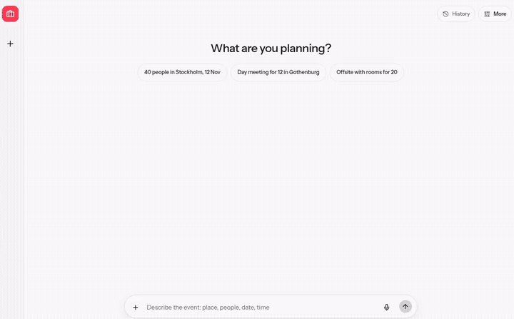
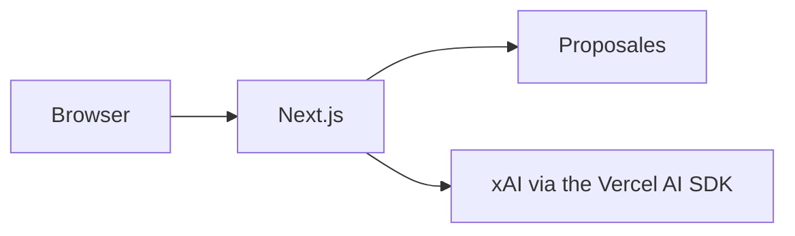

# Planner bench

One sentence in. Ranked venues back.

[](docs/media/demo.mp4)

Live: [proposales-planner-bench.vercel.app](https://proposales-planner-bench.vercel.app)




Map: [docs/ARCHITECTURE.md](docs/ARCHITECTURE.md). Notes: [notes/](notes/README.md).

## Run

```bash
pnpm install
pnpm dev
pnpm test
pnpm build && pnpm e2e
```

Copy `.env.example` to `.env.local`. Fixture mode is the default. Open the address the dev server prints. A numeric address does not hydrate.

On Vercel the Root Directory is still `planner-bench` until that setting is cleared.

## References

- [@adaptate/core](https://www.npmjs.com/package/@adaptate/core) and [@adaptate/utils](https://www.npmjs.com/package/@adaptate/utils)
- [Vercel AI SDK](https://ai-sdk.dev) and [@ai-sdk/xai](https://www.npmjs.com/package/@ai-sdk/xai)
- [shadcn/ui](https://ui.shadcn.com)
- [Playwright](https://playwright.dev)
- [layout-content-view](https://github.com/p10ns11y/plugins/tree/31d93a0355838d8b24511966ae1ba0062c05f012/layout-content-view) at `31d93a0`
- [Mermaid](https://mermaid.js.org)
- [Instrument Sans](https://fonts.google.com/specimen/Instrument+Sans)
- [AG-UI](https://github.com/ag-ui-protocol/ag-ui) is not connected
