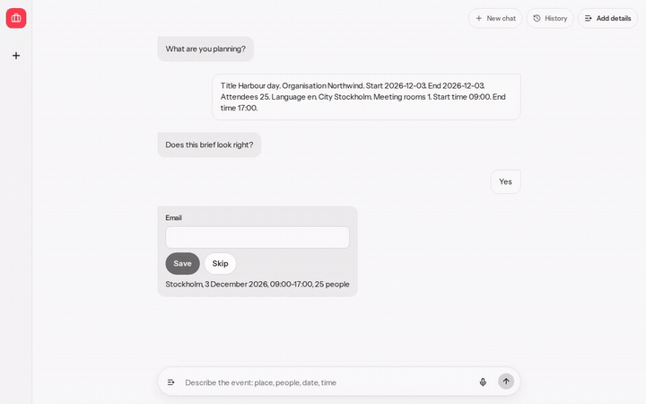
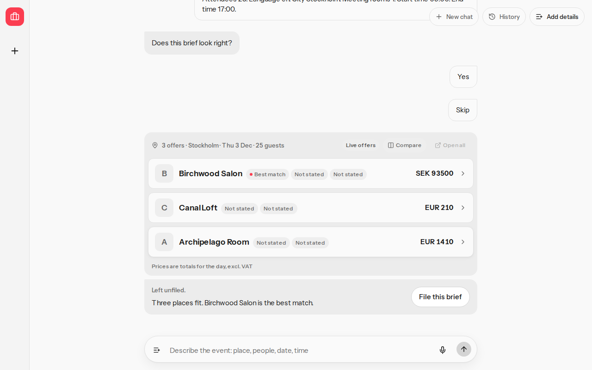
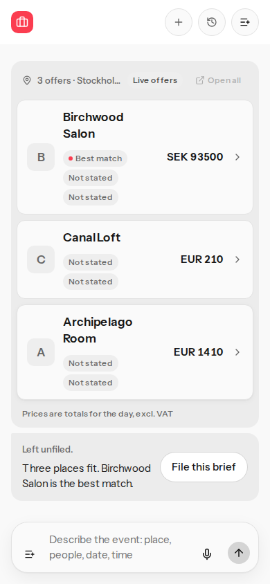

# Planner bench

## Overview

One sentence in. Ranked venues back.

Proposales API readers are validated with [@adaptate/utils](https://www.npmjs.com/package/@adaptate/utils), and brief gaps use [@adaptate/core](https://www.npmjs.com/package/@adaptate/core). Both are my published npm packages (Zod plus OpenAPI), so the app is built on my own open-source tooling. Source: [adaptate](https://github.com/p10ns11y/adaptate).

[](docs/media/walkthrough.mp4)

Live: [proposales-planner-bench.vercel.app](https://proposales-planner-bench.vercel.app)





## Contents

| Section | What it is |
| --- | --- |
| [Map](#map) | Reading order |
| [Run](#run) | Local commands |
| [References](#references) | Packages and tools |

## Map

```mermaid
flowchart LR
  A[Front page] --> B[Actualization] --> C[Product] --> D[Architecture] --> E[Work log] --> F[Steering]
  click A href "https://github.com/p10ns11y/proposales-planner-bench/blob/main/README.md" "Front page" _blank
  click B href "https://github.com/p10ns11y/proposales-planner-bench/blob/main/notes/actualization.md" "Actualization" _blank
  click C href "https://github.com/p10ns11y/proposales-planner-bench/blob/main/notes/planner-product.md" "Product" _blank
  click D href "https://github.com/p10ns11y/proposales-planner-bench/blob/main/docs/ARCHITECTURE.md" "Architecture" _blank
  click E href "https://github.com/p10ns11y/proposales-planner-bench/blob/main/notes/worklog.md" "Work log" _blank
  click F href "https://github.com/p10ns11y/proposales-planner-bench/blob/main/notes/steering.md" "Steering" _blank
```



Read in order: [Front page](./README.md), [Actualization](./notes/actualization.md), [Product](./notes/planner-product.md), [Architecture](./docs/ARCHITECTURE.md), [Work log](./notes/worklog.md), [Steering](./notes/steering.md).

## Run

```bash
pnpm install
pnpm dev
pnpm test
pnpm build && pnpm e2e
```

Copy `.env.example` to `.env.local`. Fixture mode is the default. Open the address the dev server prints.

## References

- [@adaptate/core](https://www.npmjs.com/package/@adaptate/core) and [@adaptate/utils](https://www.npmjs.com/package/@adaptate/utils). Source: [adaptate](https://github.com/p10ns11y/adaptate)
- [Vercel AI SDK](https://ai-sdk.dev) and [@ai-sdk/xai](https://www.npmjs.com/package/@ai-sdk/xai)
- [AG-UI](https://github.com/ag-ui-protocol/ag-ui)
- [shadcn/ui](https://ui.shadcn.com)
- [Playwright](https://playwright.dev)
- [p10ns11y/plugins](https://github.com/p10ns11y/plugins): my plugin repo, loaded by Grok Build, cursor-agent, local and cloud Cursor, and Claude Code (marketplace)
- [layout-content-view](https://github.com/p10ns11y/plugins/tree/31d93a0355838d8b24511966ae1ba0062c05f012/layout-content-view) at `31d93a0`
- [Mermaid](https://mermaid.js.org)
- [Instrument Sans](https://fonts.google.com/specimen/Instrument+Sans)
- [Firecrawl](https://www.firecrawl.dev): the tool I used for research and filtering on the night of 5 Oct.
- [Superdesign](https://superdesign.dev): the design agent behind the UI.

Back: [start](#planner-bench)

Read next: [Actualization](notes/actualization.md)
