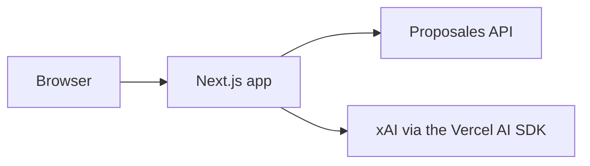

# Planner bench

One line names a city, a date and time, and how many people. The bench confirms those facts, then ranks venues. More stays closed until it is opened. The fields inside it edit the rest of the brief. The package name is proposales-planner-bench. The words on the screen stay Planner bench.

The live app is at https://proposales-planner-bench.vercel.app.

Research, findings, and plans are in [Notes](notes/README.md).

## Run

```bash
pnpm install
pnpm dev
```

Open the address the dev server prints. A numeric address in its place does not hydrate.

Fixture mode is the default. It needs no keys and makes no network calls. The ranked rows come from the fixture.

Copy `.env.example` to `.env.local`. The key names are `PROPOSALES_API_KEY` and `XAI_API_KEY`. Do not write the values in the repo, and do not commit `.env.local`. Leave `PROPOSALES_MODE` unset to stay on the fixture. Set `PROPOSALES_MODE` when you want the live Proposales API, and set `PROPOSALES_API_KEY` with it. Leave `XAI_API_KEY` unset to keep the scripted extractor. `PLANNER_MODEL` overrides the model id.

A line such as this reaches confirm, then the match:

`I need a place in Stockholm for 40 people on 12 November 2026, from 09:00 to 17:00, with dinner and a meeting room.`

Say yes, then skip favorites. Three ranked rows appear. That line is English, so the language is `en`. Add an email under More, then say `file`. In the detail, File with no email opens More and focuses Email. It does not call the server. After filing, the button reads Filed and is disabled.

Restart `pnpm dev` after a change to `.env.local`. Use the same Stockholm line, confirm, and skip favorites. Company lookup and filing then use the live API. When the account has proposals, those rows are live Proposales data and the screen says `Live offers`. A title that ends with ` (demo venue)` is shown without that suffix, and the total is the sum of each block's package split times its quantity. The account company name is not used as a venue name. If the search is empty or the live load fails, the rows are sample offers and the screen says `Sample offers`. If company lookup fails, ranking still runs and the screen says `Filing is unavailable right now.` A failed filing stays on that sentence and does not say a draft was created. Under More, set Email, save, and say `file`. A later `file` returns that filing and does not call Proposales again. Leave Event name empty to title the draft with the city and date, or set Event name to use that instead. The screen says `A draft was created in Proposales.`

## Test

Unit tests:

```bash
pnpm test
```

End-to-end tests run the scripted planner in fixture mode. Build first, then Playwright:

```bash
pnpm build
pnpm e2e
```

The layout probe reads layout-content-view from the pinned commit in References. Build, start the production server, set `LCV_ROOT` to that plugin directory, and run:

```bash
node e2e/run-probe.mjs
```

CI uses Playwright Chromium for that probe.

## Architecture

The shape of the app is in [docs/ARCHITECTURE.md](docs/ARCHITECTURE.md).



## API contract

The committed spec is `src/contract/openapi.json`. Contract tests turn that file into Zod schemas with `@adaptate/utils`. Those schemas stay in the tests. At runtime, `src/proposales/http-client.ts` checks responses with tolerant readers, because real responses carry nulls and loose URLs or emails.

## Model

Grok runs through xAI only when `XAI_API_KEY` is set on the server. The default model id is `grok-4.7`. `PLANNER_MODEL` overrides that id. A missing key, a model error, or a timeout falls back to the scripted extractor after 40 seconds. The turn and chat routes set maxDuration to 60. Brief extraction requests low reasoning effort. A Vercel deploy without `XAI_API_KEY` stays scripted.

The app is at the repository root. On Vercel the Root Directory is still `planner-bench` until that setting is cleared. Fixture mode needs no secrets.

Speech uses the browser speech API when the browser has it. Typing always works.

Keys stay in server environment variables. Do not commit `.env` files.

## References

- Grok Bot desktop app screenshots supplied for this redesign (the chat column, the card inside a reply, and the right-panel header). These are the primary visual source.
- Vercel AI Elements: https://ai-sdk.dev/elements (Conversation, Tool, Artifact, Prompt Input, Shimmer, Suggestion), captured 2026-10-07.
- shadcn/ui: https://ui.shadcn.com/docs/components/sheet, /dialog, and /skeleton, captured 2026-10-07.
- grok.com public logged-out landing, captured 2026-10-07.
- Instrument Sans: https://fonts.google.com/specimen/Instrument+Sans (OFL).
- Method notes live with the reference pack in `docs/design-refs/REFERENCE-PACK.md`.
- Refero and Mobbin were connected but paywalled at the time of writing; no content from them is included.
- No brand is copied wholesale. Coral and greys are adapted roles, and no Grok or xAI logo or wordmark is used in the app.
- Playwright: https://playwright.dev/docs/intro
- layout-content-view: https://github.com/p10ns11y/plugins/tree/31d93a0355838d8b24511966ae1ba0062c05f012/layout-content-view
- tldraw: https://tldraw.com/
- Mermaid: https://mermaid.js.org/
- AG-UI: https://github.com/ag-ui-protocol/ag-ui
- [@adaptate/core](https://www.npmjs.com/package/@adaptate/core): conditional schemas for the brief and offer fitness checks
- [@adaptate/utils](https://www.npmjs.com/package/@adaptate/utils): OpenAPI to Zod in the contract tests
