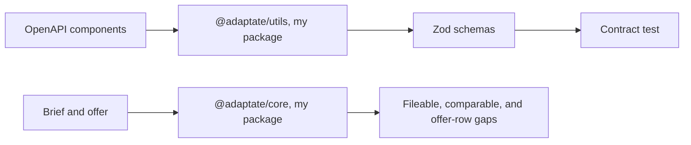
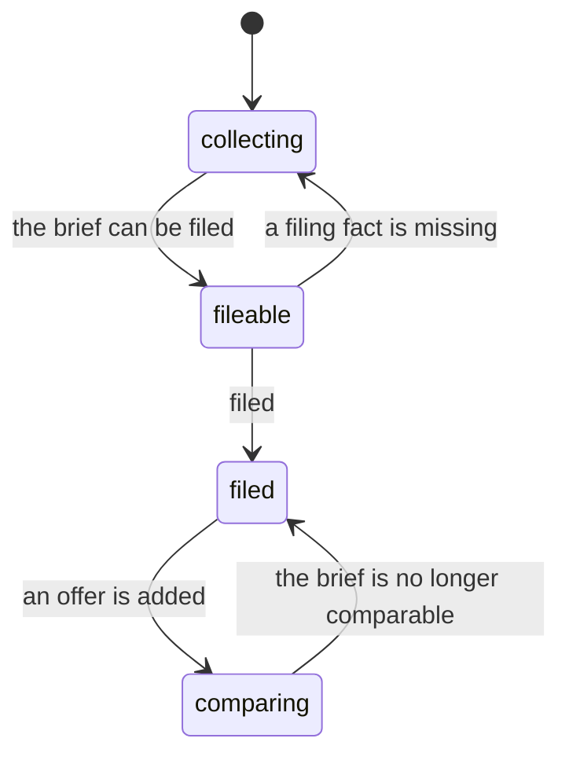
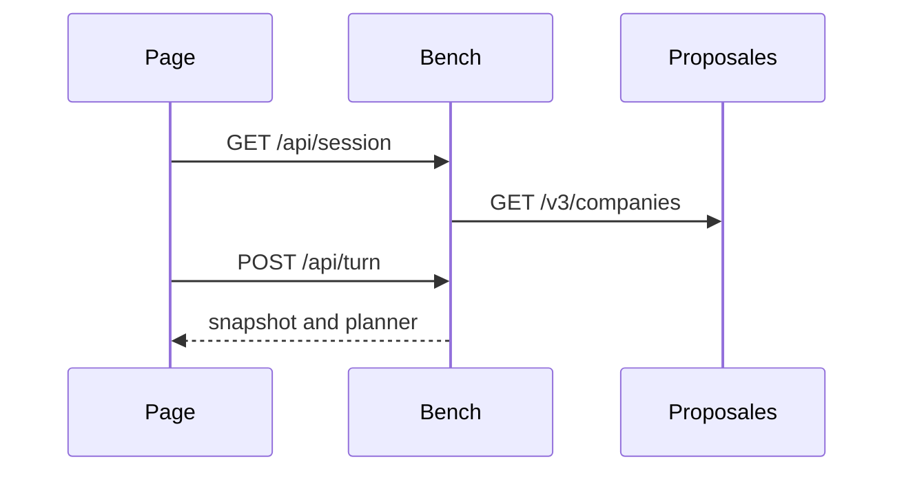
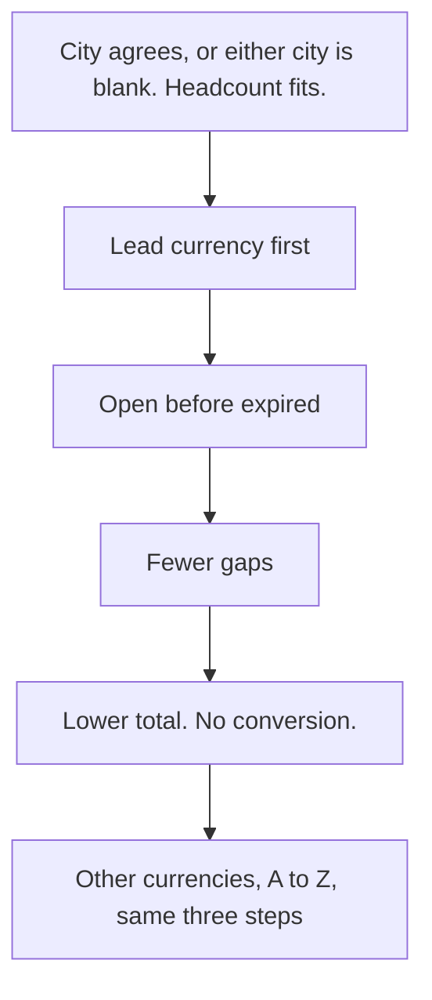
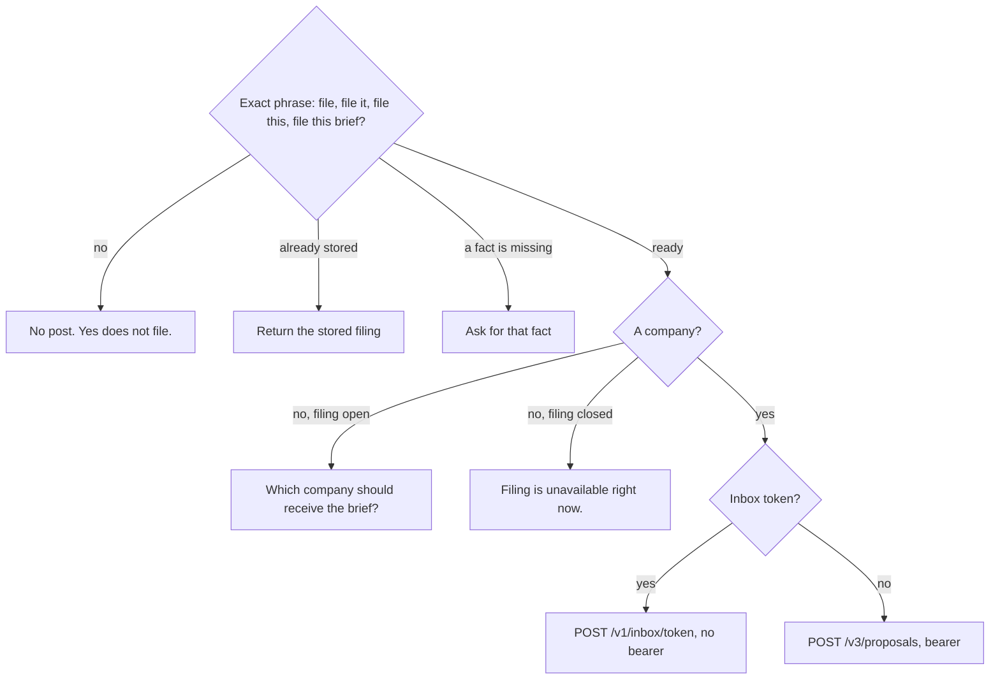
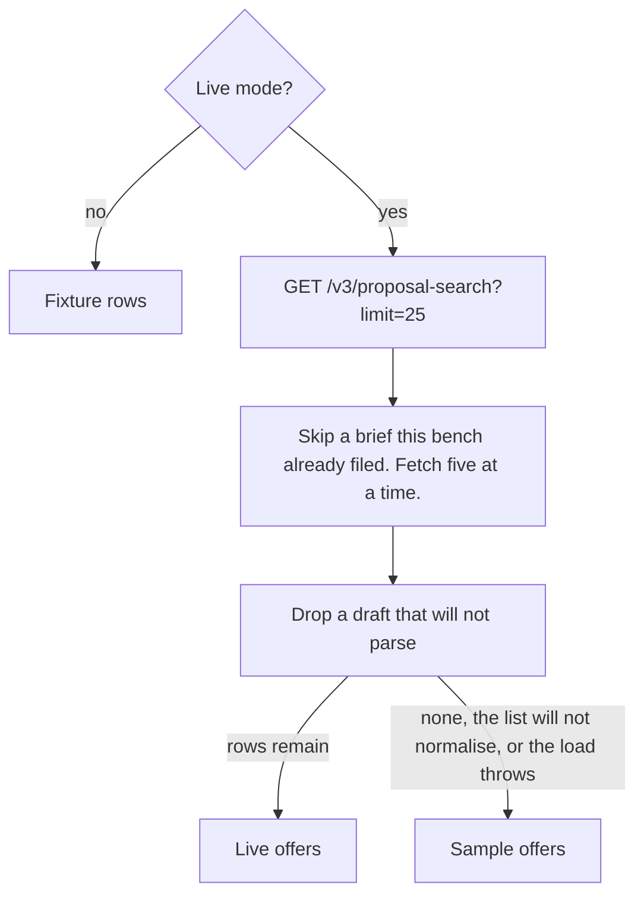

# Architecture

## Overview

A confirmed brief is ranked into venues. Dates are UTC. A row expires before today. Clocks stay `HH:MM`.

## Contents

| Section | What it is |
| --- | --- |
| [System](#system) | Session, packages, contract |
| [Request](#request) | Session, turn, replies |
| [Screen](#screen) | What the page shows |
| [Rank](#rank) | Order of the rows |
| [Filing](#filing) | When a brief is sent |
| [Offers](#offers) | Fixture, live, sample |
| [Model](#model) | When a model runs |
| [Money](#money) | Budget and currency |
| [Checks](#checks) | Scripts |
| [References](#references) | Back and next |

## System

Picture: [diagrams/architecture.tldr](diagrams/architecture.tldr).

[@adaptate/core](https://www.npmjs.com/package/@adaptate/core) and [@adaptate/utils](https://www.npmjs.com/package/@adaptate/utils). Source: [adaptate](https://github.com/p10ns11y/adaptate).

| Schema | Rejects |
| --- | --- |
| Company | A null timezone, a loose website |
| Proposal | A loose email, a loose website, null agreement, null pending |

The contract test is the only check of those schemas. The live readers keep id, name, inbox token, and unknown data, including a company or a proposal the schemas reject.

Offers are added only after filing. Ranked rows can still show while collecting or fileable.

## Request

Turn and chat allow 60 seconds. The page posts the turn. Chat can stream the same offer group, with tools to update the brief, file it, add an offer, and compare offers.

| Case | Result |
| --- | --- |
| Company list fails | 200, no companies, filing unavailable |
| Turn body is not an object, or the action is unknown | 400 |
| Invalid JSON, a snapshot that will not parse, or live mode with an empty key | 500 |
| No model key, a model error, or the 40 second stop | 200, scripted |
| "What is this?" | `This finds a place for an event. Say the city, when it is, and how many people.` |
| Off topic | `This bench finds a place for an event.` |
| The page cannot reach Proposales | `Couldn't reach Proposales. Your brief is saved.` |

`XAI_API_KEY` and `PROPOSALES_API_KEY` stay on the server. The Proposales request sends the bearer. The model key goes to xAI. The client sees a company as id and name.

## Screen

| Piece | Rule |
| --- | --- |
| Comparable | City, start date, start time, attendees, end time. End time may be absent for a duration, or when the end date is after the start. |
| Favorites | `Which places do you already have in mind? You can skip.` |
| Add details | Opens filled. One fold stays open: Contact, Event and dates, People and rooms, Budget, Preferences. The open fold is the first missing required fact, otherwise Contact. No change says Nothing changed. The budget label is the brief currency. A named currency stays when the city changes. |
| Compare | Two or three offers, and the group is at least 640px wide. |
| Show more | Five rows, then five more. Typing still works. |
| History | One row per chat, named from the brief, with the venue count and the local time. Filed twice, or Filed N times, when filing happened more than once. |
| Voice | A network miss says `Voice input paused. Tap the mic to try again.` Typing clears it. It also clears after six seconds. |

## Rank

| Rule | What it does |
| --- | --- |
| City | Trim, lower case, strip accents. A different city drops the offer. |
| People | No count: keep. Outside a set minimum or maximum: drop. |
| Lead | A named budget or a stated currency. Otherwise the event city's currency. An unknown city uses EUR. |
| Best match | The first row that is not expired. An expired offer stays behind open offers in its own currency, and can still sit above an open offer in another currency. |
| Favorite | A mark. The order stays. |

Absent breakout or diet is `Not stated`. That mark is not a gap. A stated breakout or a named diet the offer misses is a gap.

## Filing

| Fact | Rule |
| --- | --- |
| Fileable | Email, both dates, attendees, a language, and rooms when the end date is after the start. A single day uses the start date as the end date. |
| Comparable | The match set above. Filing does not use it. |
| Save and Skip | Email, end date, or end time. Save stores the value. Skip sets `Left unfiled.` Save tries to file only on a card opened by File or by an exact file phrase. |
| Another gap | One sentence. File stays off. |
| Inbox | `The brief is filed.` |
| Draft | `A draft was created in Proposales.` |
| Post fails | `Filing is unavailable right now.` |
| After filing | The button reads Filed. A later city or start date offers `Start a new chat`. |
| Language | English with no stated language stores `en`. A set language stays, including Swedish, French, or German. |

## Offers

## Model

Rank does not call the model. Confirm, favorites, show more, and opening a row stay scripted.

| | |
| --- | --- |
| No `XAI_API_KEY` | Scripted, 200 |
| With a key | Vercel AI SDK and `@ai-sdk/xai`. No `AI_GATEWAY_API_KEY`. Id `grok-4.7`, or `PLANNER_MODEL`. Low effort. Stop at 40 seconds. |
| A schema miss or a throw | Scripted |
| A field the script already set | The script wins. A model field stays when the script left it unset. |

| Words | Clock |
| --- | --- |
| Full day, all day | 09:00–17:00 |
| Half day, morning | 09:00–12:00 |
| Afternoon | 13:00–17:00 |

Day parts do not filter or rank.

## Money

| Basis | Ceiling |
| --- | --- |
| None | Stay on confirm. Ask "Is that per person or total?" Yes stays hidden. |
| Per person, with attendees | Minor units times the count |
| Per person, no attendees | No ceiling |
| Total | The minor units |
| Amount only | Minor units, no basis |

Minor units are the major amount times 100, rounded. Per person, pp, each, per head, per attendee, per guest, and a head are per person. Total, in total, and overall are total. A stated basis skips the question. The word yes leaves the basis unset. A different currency is not compared. The same currency over the ceiling is over budget.

## Checks

| Script | Does |
| --- | --- |
| `pnpm qa` | Pair titles, build, run the critical-path browser check |
| `pnpm crap` | CRAP. Threshold 6 |
| `pnpm mutation` | StrykerJS. Threshold 0.95 |
| `pnpm verify` | Unit, contract, build, browser, probe, CRAP, mutation |

`--skip-mutation` defers mutation. No model calls. Versions and the braces advisory: [control card](../notes/control-card.md).

## References

Findings: [FINDINGS.md](FINDINGS.md). Browser notes: [critical path](../qa/critical-path.md), [composer microphone](../qa/composer-mic.md), [filing and email](../qa/filing-email.md).

Back: [Product](../notes/planner-product.md)

Read next: [Work log](../notes/worklog.md)
