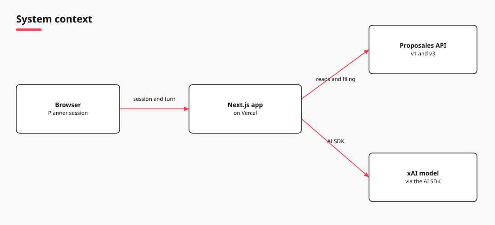
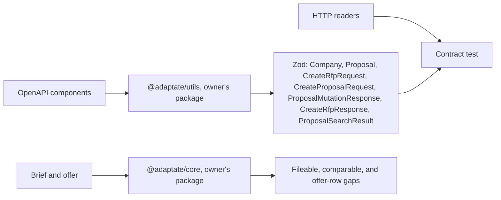
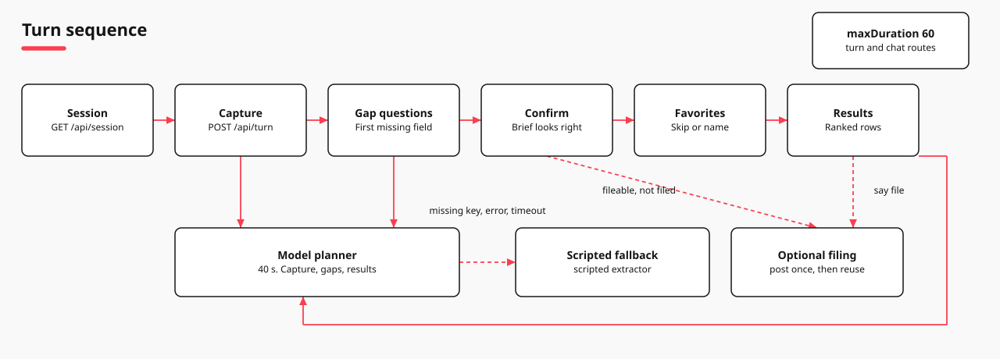

# Architecture

A brief is confirmed, then venues are ranked. Instants and `today` are UTC (`Date.UTC` for weekdays). `expires_at` seconds become a UTC instant and a row expires before `today`. Clocks stay `HH:MM`.

## System

`PlannerSession` runs at the repository root. Each post sends the action and the snapshot. Picture source: [diagrams/architecture.tldr](diagrams/architecture.tldr).

[@adaptate/core](https://www.npmjs.com/package/@adaptate/core) and [@adaptate/utils](https://www.npmjs.com/package/@adaptate/utils). Source: [adaptate](https://github.com/p10ns11y/adaptate).

## Request

`GET /api/session` calls `GET /v3/companies`. Actions are `POST /api/turn`. The page does not call `useChat`. The model runs for capture, a gap answer, or a results revision, and only with `XAI_API_KEY`: `generateObject`, 40 seconds, low effort. The reply is the snapshot and `planner`. `today` is `new Date().toISOString().slice(0, 10)`. `maxDuration` is 60.

| Case | Result |
| --- | --- |
| Company list throws | 200, no companies, `filingAvailable` false. `Filing is unavailable right now.` |
| Snapshot missing | Load the session again |
| Chat | Reply, snapshot, `data-offer-group`. Tools `updateBrief`, `fileBrief`, `addOffer`, `compareOffers`. Failure, including the 40 second abort, uses the scripted turn. |
| "What is this?" | `This finds a place for an event. Say the city, when it is, and how many people.` |
| Off topic | `This bench finds a place for an event.` |

## Screen

Posts: [Filing](#filing).

| Piece | Rule |
| --- | --- |
| Comparable | City, start date, start time, attendees, end time. End time may be absent for a duration, or an end date after the start. |
| Favorites | `Which places do you already have in mind? You can skip.` |
| Add details | Opens filled from the brief. One fold stays open. Contact: organisation and email. Event and dates: name, city, dates, and times. People and rooms: guests, rooms, meeting rooms, and food. Budget: amount, basis, and currency. Preferences: language and notes. The open fold is the first missing required fact, otherwise Contact. Apply sends `moreEdited` only when a field changed. No change says Nothing changed. The budget label is the brief currency, for example `Budget (SEK)`. The amount writes `budgetMinor` and leaves `budget.scope` unset. A named currency stays when the city changes. |
| Compare | Two or three offers, group at least 640px. |
| Show more | Five rows. Typing always works. |
| History | One row per chat in `localStorage`, named from the brief. The row shows the venue count and the local time. Filed twice, or Filed N times, when filing happened more than once. |
| Voice | A network miss says `Voice input paused. Tap the mic to try again.` Typing clears that note. It also clears after six seconds. |

## Budget

Minor units are the major amount times 100, rounded. No scope: stay on confirm, ask "Is that per person or total?", and keep Yes hidden. Per person with attendees: minor units times the count. Per person with no attendees: no ceiling. Total: the minor units. No budget object: `budgetMinor` only. A different currency is not compared. Same currency over the ceiling: over budget. `readBudgetScope`: per person, pp, each, per head, per attendee, per guest, and a head are `per-person`. Total, in total, and overall are `total`. A stated basis skips the question. The word yes leaves the basis unset. Saving Add details leaves the open offer.

## Extraction

No `XAI_API_KEY`: `extractBriefPatch`, `planner` scripted, 200. With a key: `generateObject` via the Vercel AI SDK and `@ai-sdk/xai`. No `AI_GATEWAY_API_KEY`. Id `grok-4.7` or `PLANNER_MODEL`. Low effort. Abort at 40 seconds. `briefExtractionSchema` stores `timeAssumption.dayPart` only and has no `budgetMinor`. A schema miss or a throw uses the scripted patch. A scripted field wins. A model field stays when the script left it unset.

Confirm, favorites, show more, and opening a row leave `planner` scripted. Rank does not call the model. English with no stated language stores `en` ([Filing](#filing)). `assumedSpan`: full day and all day 09:00–17:00; half day and morning 09:00–12:00; afternoon 13:00–17:00. The same amount and currency, with no scripted basis, keeps the model basis. Day parts do not filter or rank, and fetch does not filter on time of day.

## Rank

| Step | Rule |
| --- | --- |
| City | Blank: skip. Else trim, lower case, strip accents. A different city drops the offer. |
| People | No count: keep. Outside a set minimum or maximum: drop. |
| Lead | A named budget or stated currency leads. Otherwise the event city's currency leads, including EUR when the city is unknown. |
| One currency | Open offers before expired ones, then fewer gaps, then the lower total. No conversion. |
| Other currencies | A to Z after the lead group. Totals stay inside one currency. |
| Best match | First row that is not expired. None: `bestNonExpiredIndex` is -1. An expired offer stays behind open offers in its own currency, and can still sit above an open offer in another currency. |

## Not stated

Absent breakout or diet is `Not stated` (`Breakout not stated`, `Diet not stated`): neutral, not a gap. A stated breakout the offer misses is a breakout gap. A named diet the offer misses is that diet's gap.

## Where the code lives

`src/app` to `src/flow` (`src/domain`, `src/proposales`). `src/views` draws the shell, detail, and Add details. `renderPart` passes `hiddenCount`, `openName`, `onOpen`, and `onShowMore` to `OfferGroupCard`.

`mergeBrief` replaces fields the patch sets. A clock replaces `timeAssumption` and can clear it. Food merges meal and diets and sets `foodRequired` when unset. Diet names share one spelling. Budget currency is upper case. Fitness uses `makeConditionalSchemaTransformer` from `@adaptate/core`, the owner's package. Rooms are required when the end date is after the start. `normaliseProposal` sums each package split times quantity into rooms, food, space, and extras: `value_without_tax` when present, otherwise `value_with_tax`. It drops a trailing ` (demo venue)`. The account company name is not a venue name.

## Offers and failures

Unset, or any mode but `live`: fixture rows, no source chip. Live: `GET /v3/proposal-search?limit=25`, skip `data.planner_bench_brief`, fetch five at a time. Drop one bad draft. One failed normalise, an empty search, or a thrown load replaces the list with sample offers. Else: live offers.

Readers: `companyReader`, `rfpReader`, `draftReader`, `proposalEnvelopeReader`, `searchEnvelopeReader`, `searchIdentityReader`. A null inbox token stays null. `data` stays unknown. User agent `planner-bench/0.1.0`. City, capacity, `min_capacity`, `day_part`, and `event_type` copy when they parse. `XAI_API_KEY` and `PROPOSALES_API_KEY` stay on the server. The Proposales request sends the bearer. The model key goes to xAI. Turn JSON returns the snapshot and `planner`. Each company on the client snapshot is id and name.

| What happens | Status |
| --- | --- |
| Invalid JSON on turn or chat. Neither route catches `request.json()`. | 500 |
| Snapshot schema fails. `parse` throws. | 500 |
| Live mode, empty key. `createClient` throws on session, turn, and chat. | 500 |
| Turn body is not a JSON object, or the action is unknown. | 400 |
| Missing key, model error, or the 40 second timeout. | 200, `planner` scripted |
| Company lookup throws as the session opens. | 200. Ranking still runs. `Filing is unavailable right now.` |
| Turn status failed, snapshot will not parse, or the fetch throws. | `Couldn't reach Proposales. Your brief is saved.` |

## Filing

Fileable means email, both dates, attendees, a language, and rooms when the end date is after the start. Matching uses the comparable set, not this one.

| Trigger | Result |
| --- | --- |
| Yes, filing stored | No post. Notice cleared. Favorites |
| Yes, no email | Email input, Save, and Skip. No post. Save tries to file. Skip sets `Left unfiled.` |
| Yes, end date or end time is the gap | That input, Save, and Skip. Save on an end time returns to confirm. Save on an end date tries to file. Skip sets `Left unfiled.` |
| Yes, another gap | One sentence for that gap. No post |
| Yes, fileable | Selected company, else the first. Then post |
| `file`, filing stored | Return it. No Proposales call. Phase stays |
| `file`, email, end date, or end time missing | That input, Save, and Skip. Save on an email or an end date tries to file. File stays enabled when the only gap is email. |
| `file`, another gap | File is disabled. The same gap check writes the hint. No post. Phase stays |
| No company, filing open | Yes: no post, empty notice. `file`: `Which company should receive the brief?` |
| No company, filing closed | `Filing is unavailable right now.` |
| Inbox token | `POST /v1/inbox/{token}`. No bearer. `The brief is filed.` |
| No token | `POST /v3/proposals`. Bearer. Detail and thread: `A draft was created in Proposales.` |
| Post throws | `Filing is unavailable right now.` No draft sentence |
| Yes, after the post | Favorites. Notice empty on success |
| `file`, after the post | Phase stays. Inbox sentence on the notice |

`addEnglishLanguage` stores `en` for two words from a small English list, with no accents and no Swedish, French, or German markers. A set language, a patch language, `in swedish`, `på svenska`, or `Language` plus two letters other than `en` stays.

One `firstFileableGap` check feeds the hint and the File button. A single-day brief uses the start date as the end date for that check, so an end-date hint does not sit beside an enabled File button. Detail sends `file` when an email is set. No email opens Add details, focuses Email, and makes no server call. The detail says `Add details opened so venues reply to this address.` An end date or end time still missing is an input in the detail, with Save and Skip, and the status line stays hidden unless there is an error. After filing, the button reads Filed and is disabled. A later city or start date keeps the filed brief and shows `Start a new chat for {name}.` The button starts a fresh chat.

`projectBriefFlow` is `collecting`, `fileable`, `filed`, or `comparing`. Offers append only from `filed`. Ranked rows can still show while `collecting` or `fileable`.

An empty event name uses city and date. Dates are `Z` timestamps, `00:00` when the clock is missing. Inbox `is_test` is `1`. `draftBody` is the inbox fields plus `planner_bench_brief`, not a stored `Proposal.data`.

`/api/chat` files in `runFixtureTurn` when the text says file and the company id is `selectedCompanyId`. `fileBrief` sends `file the brief` and may set the company. Chat can post again. The page returns the stored filing.

## Contract

`proposalesSchemas()` uses `@adaptate/utils`, the owner's package, for Proposal, Company, CreateRfpRequest, CreateProposalRequest, ProposalMutationResponse, CreateRfpResponse, and ProposalSearchResult. DevDependency. Only the contract test imports it. That test checks the schemas against `companyReader`, `proposalEnvelopeReader`, `rfpReader`, `draftReader`, `searchEnvelopeReader`, and `searchIdentityReader`. Runtime uses the readers in `http-client.ts`. `openAPISchemaToZod` drops `additionalProperties`.

Company rejects a null timezone and a loose website. Proposal rejects a loose email, a loose website, null `is_agreement`, and null `pending`. Readers keep id, name, inbox token, and unknown `data`. HTTP tests accept a company and a proposal those schemas reject.

## Checks

`verify` runs typecheck, lint, and `pnpm verify --skip-mutation`. Node 22, pnpm 9, `next typegen` (`LayoutProps`), and `braces@3.0.3` are on the [control card](../notes/control-card.md). On Vercel the Root Directory is still `planner-bench` until that setting is cleared.

| Script | Does |
| --- | --- |
| `qa-critical-path.mjs` | Pair titles, build, run critical-path Playwright. `pnpm qa` |
| `crap-score.mjs` | CRAP. Threshold 6. `pnpm crap` |
| `mutation-score.mjs` | StrykerJS. Threshold 0.95. `pnpm mutation` |
| `verify.mjs` | Unit, contract, build, e2e, probe, CRAP, mutation. `pnpm verify` |

`--skip-mutation` defers mutation. No model calls.

Findings: [FINDINGS.md](FINDINGS.md). Browser notes: [critical path](../qa/critical-path.md), [composer microphone](../qa/composer-mic.md), [filing and email](../qa/filing-email.md).

Back: [Product](../notes/planner-product.md)

Read next: [Work log](../notes/worklog.md)
