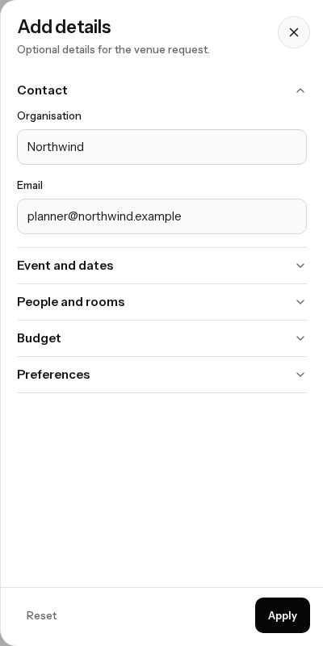
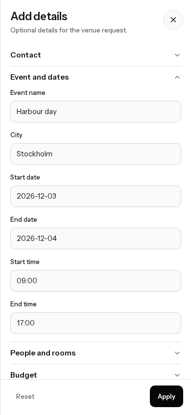

# Add details prefill and folds

After a brief, Add details opens with the known fields filled. Contact is open when nothing required is missing. Event and dates, People and rooms, Budget, and Preferences stay closed until opened, and only one stays open.

Phone and desktop, 390×844 and 1280×800. The drawer body does not scroll sideways.

