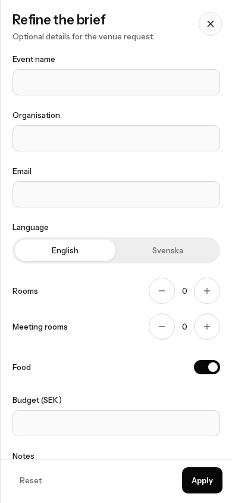
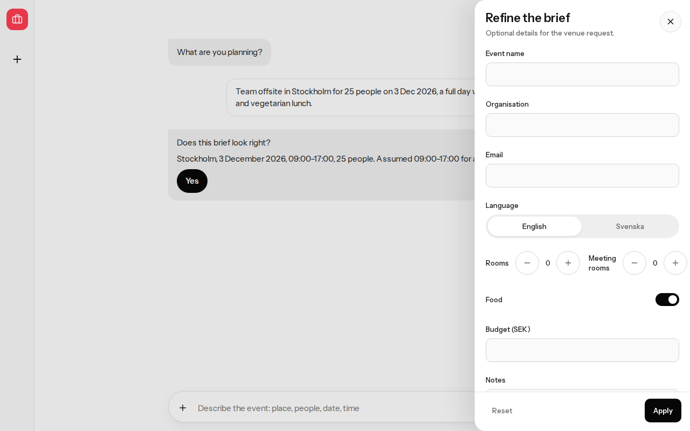
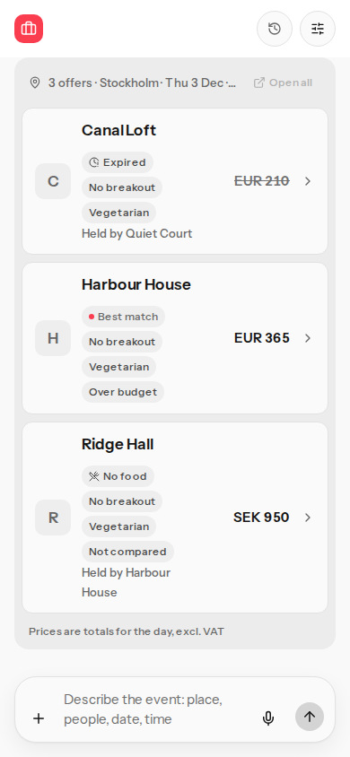
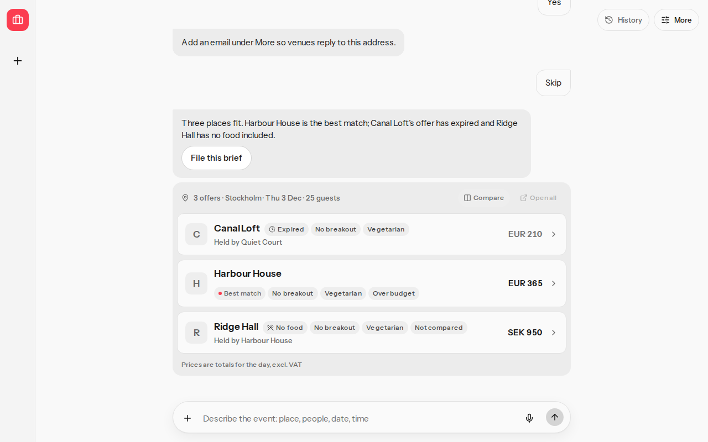

# Currency display

## Before

The Add details label was the fixed text `Budget (EUR)`. A `budgetMinor` total was compared with the offer total with no currency check, so a Stockholm brief could mark a euro offer over budget. A named `budget.currency` that differed from the offer already skipped that mark, and the card did not say the amounts were left uncompared. Offer prices were already shown in the offer currency.

## After

The event city sets the display currency from a small table:

| Place | Currency |
|---|---|
| Sweden, including Stockholm, Gothenburg, Malmö, Uppsala | SEK |
| Norway, including Oslo, Bergen, Trondheim, Stavanger | NOK |
| Denmark, including Copenhagen and Aarhus | DKK |
| Euro countries and their listed cities, including Helsinki | EUR |
| London, Manchester, Edinburgh | GBP |
| Zurich, Geneva | CHF |
| New York | USD |
| Any other city, and a brief with no city | EUR |

A currency named in the brief wins over the city and stays when the city changes. `EUR 300` stays EUR in Stockholm. `40 000 kr` and a bare `SEK` stay SEK, including in Oslo. `kr` is read as SEK. Amounts are not converted.

Offer prices stay in the currency Proposales stated. When a budget amount is present and the offer currency differs, the offer is not treated as over budget or under budget. The card says `Not compared`. The same currency can still be over budget.

The Add details label is `Budget (SEK)` for a Stockholm brief that names no currency. It follows a later city, such as Oslo to `Budget (NOK)`, until a currency is named.

## Checks

Run from the repository root in fixture mode. No live filing.

`pnpm verify` exited 0. Steps: unit, contract, e2e, lcv, crap, mutation, all ok.

| Check | Result |
|---|---|
| CRAP max | 6.00 (`briefWrittenInEnglish`, at the limit) |
| Mutation, scored modules | 0.9929 (976 killed / 983 mutants) |
| `src/domain/compare-offers.ts` | 0.9871 (305 / 309) |

The Stockholm label was checked in the critical-path scenario at 390×844 and 1280×800.

## Screenshots

Stockholm brief, no named currency, Add details open:

EUR 300 budget in Stockholm. Harbour House stays EUR and can be over budget. Ridge Hall stays SEK 950 and reads Not compared:

## Rollback

Revert the commit. No amounts are converted, and no payment path changes.
