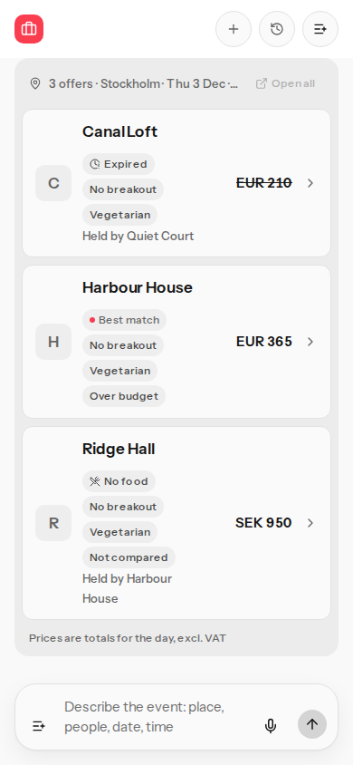
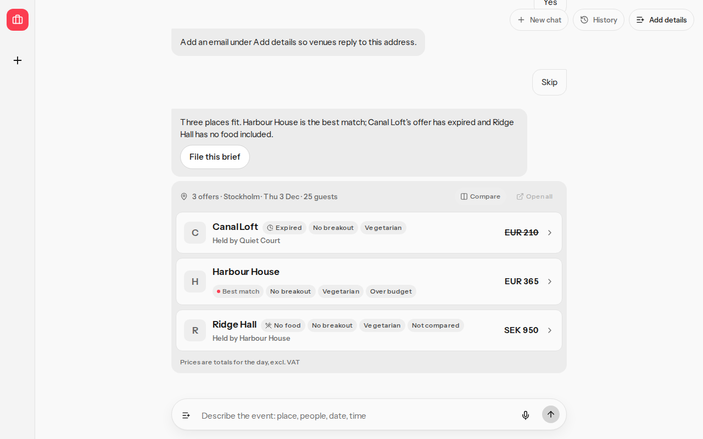
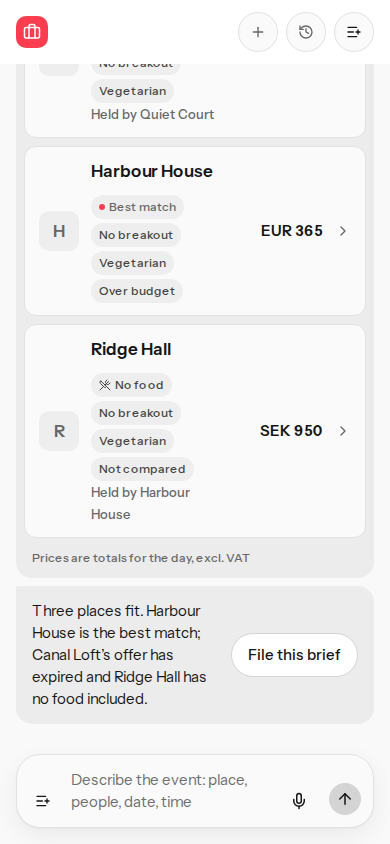
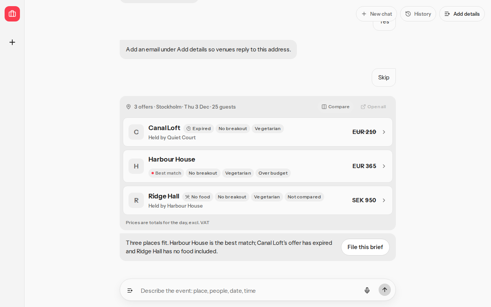

# File this brief below the ranked venues

## Before

On the results card, File this brief sat in the summary bubble, above the ranked venue list.

At 390×844, scrolling the thread to the end left the button at the top of the viewport (top −2, bottom 42) while the last venue row ended at 684. The header covered the button.

At 1280×800 the summary ended at 256, the button ran from 264 to 308, and the last venue row ended at 640.

## After

The best-match suggestion sits in one row under the ranked venues. File this brief is in that same row, on the right. The label stays "File this brief" and the test id stays `file-brief`.

At 1280×800 the suggestion and the button share one line. The button starts to the right of the sentence.

At 390×844 the sentence wraps and the button stays on the right inside the same row. There is no second block between them.

## Commands

From the repository root.

- `pnpm exec vitest run tests/offer-detail.test.tsx` passed (17 tests).
- `pnpm exec playwright test e2e/critical-path.spec.ts -g "places File this brief below the ranked venues"` passed at 390×844 and 1280×800.
