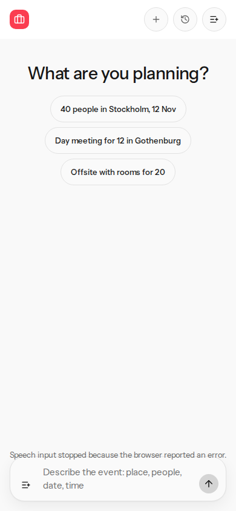
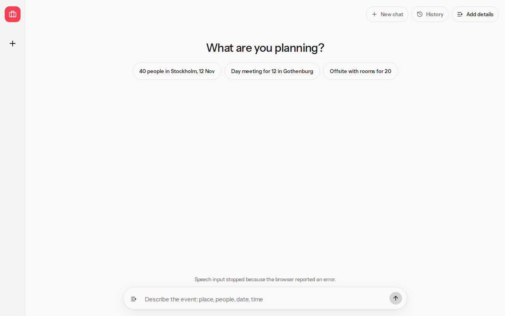
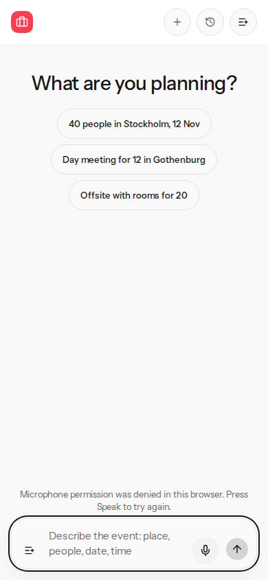
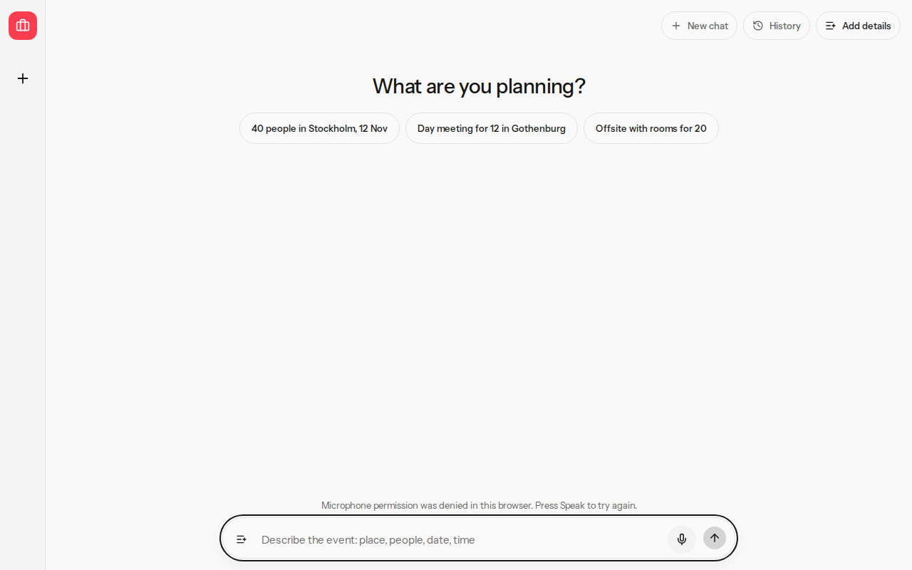

# Microphone recovery and status spacing

V12 and V13. Sample proposals only. No account data.

## Before

V12: any recognition error (`no-speech`, `network`, `aborted`, `not-allowed`, `audio-capture`) called the unavailable path. Speak was removed and stayed gone until reload.

V13: the status used `bottom: 84px`. At 390x844 the composer is 74 px tall, so the status overlapped it by 6 px. Speak was absent.

| Viewport | Gap | Status height | Speak | Composer |
| --- | ---: | ---: | ---: | --- |
| 390x844 | -6 px | 18 px | 0 | x 16, y 754, 358x74 |
| 1280x800 | 10 px | 18 px | 0 | x 312, y 726, 720x58 |

## After

Each of those errors returns to idle. Speak stays enabled, with a short status. Permission denied explains that the microphone was denied and the next press starts recognition again. A thrown `start` still hides Speak.

The status is in the dock with an 8 px gap. The composer box is unchanged.

| Viewport | Gap | Status height | Speak | Composer |
| --- | ---: | ---: | ---: | --- |
| 390x844 | 8 px | 36 px (two lines) | 1 | x 16, y 754, 358x74 |
| 1280x800 | 8 px | 18 px | 1 | x 312, y 726, 720x58 |

## Commands

From the repository root, fixture mode, empty `PROPOSALES_API_KEY` and `XAI_API_KEY`:

- `pnpm exec vitest run tests/speech-input.test.ts tests/speech-composer.test.tsx tests/composer-mic-titles.test.ts tests/source-comments.test.ts` passed (55 tests).
- `pnpm exec eslint` on the touched speech files passed after the page stub stopped aliasing `this`.
- `pnpm exec tsc --noEmit` passed.
- `pnpm exec playwright test e2e/composer-mic.spec.ts` passed at 390x844 and 1280x800. The page stub is a fake `SpeechRecognition`. It reports `not-allowed`, then a second press stays on Listening. No microphone is opened.
