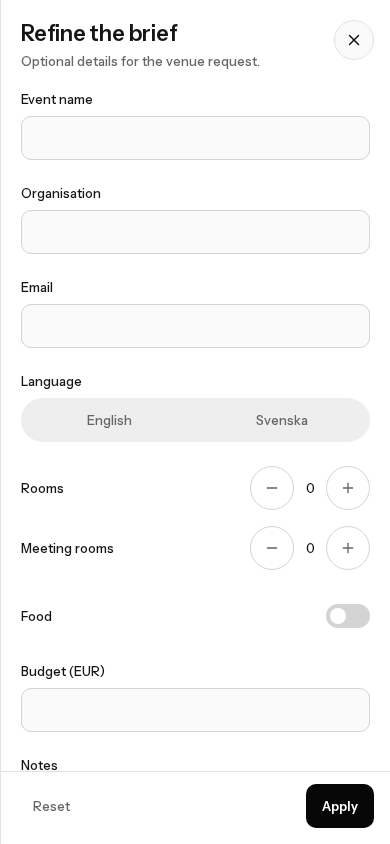
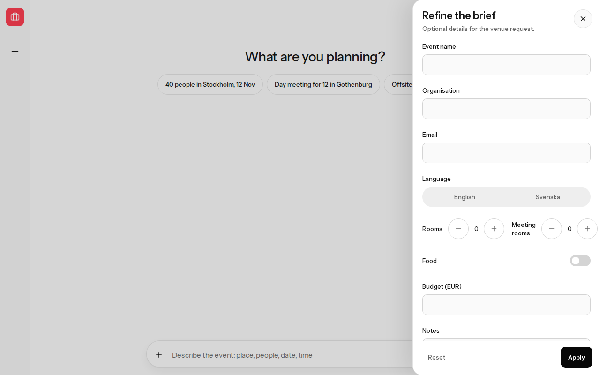
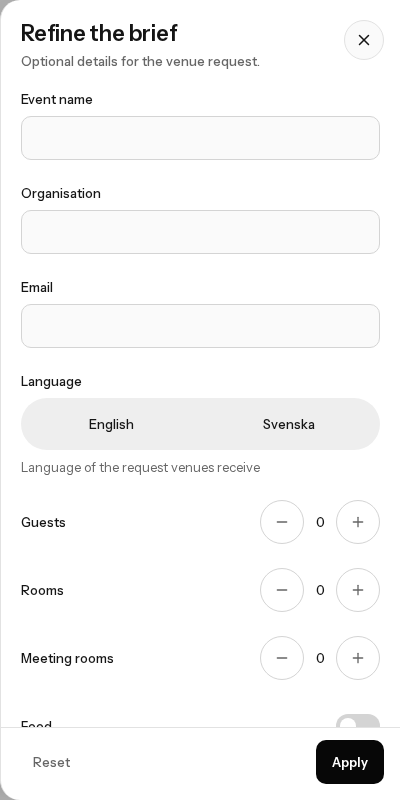
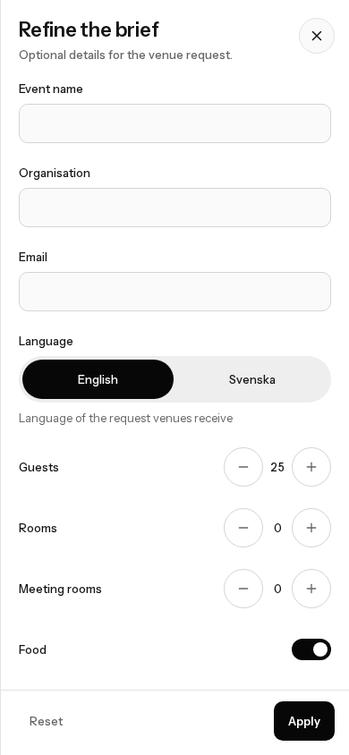
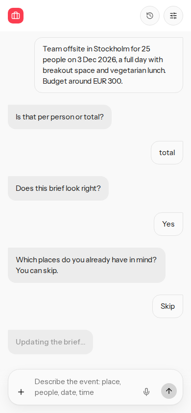
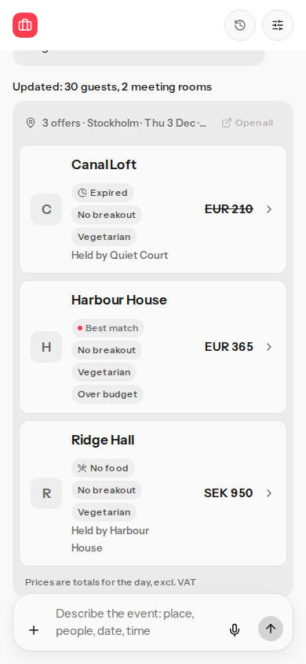
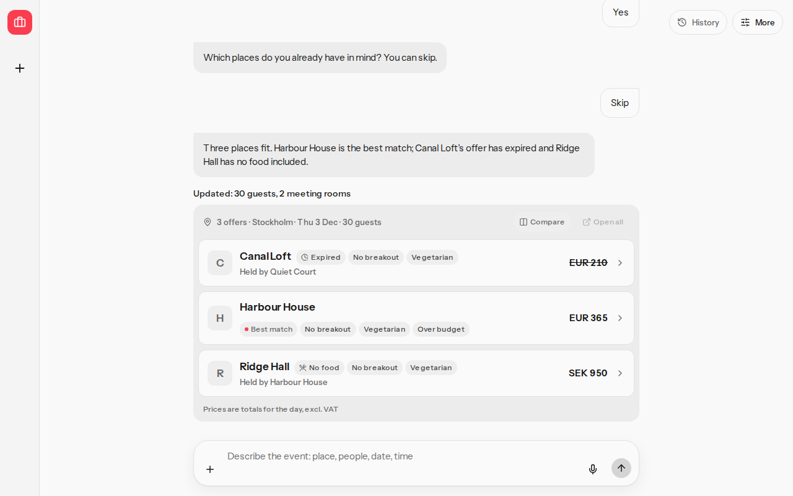

# Add details layout and state

## Before

At a desktop width the Rooms and Meeting rooms steppers shared one row. The meeting-room label wrapped beside the controls. Language buttons were 36 px tall and gray when nothing was chosen. The selected state was a white pill on the same gray track, with no hint. Apply closed the drawer without a busy state and without a line next to the results header.

The drawer body `scrollWidth` matched `clientWidth` at 360, 390, and 1280, but each paired stepper was only about 175 px wide.

## After

Each stepper is its own row: label on the left, 44 px controls on the right, the same width as the other fields. At 390 px a row is 349 px wide. At 1280 px it is 359 px wide. `scrollWidth` stays at or under `clientWidth`, and inputs, buttons, and rows stay inside the drawer body.

After an English brief, English is the only pressed option: black fill, white text, 44 px tall. Svenska stays unpressed at full opacity in primary text. With no brief yet, neither option is pressed and both stay enabled. The hint is "Language of the request venues receive".

Apply with no edits says "Nothing changed". Raising guests from 25 to 30 and meeting rooms to 2 shows "Updating the brief…" while the turn runs, then "Updated: 30 guests, 2 meeting rooms" directly above the results header. On the wide layout that header reads "3 offers · Stockholm · Thu 3 Dec · 30 guests". The Budget (EUR) label is unchanged.

## Commands

Run from the repository root.

- `pnpm lint` passed.
- `pnpm typecheck` passed.
- `pnpm crap` passed. `crap_max=6.00`. Worst function is `briefWrittenInEnglish`. In `src/views/more-update.ts`, `moreUpdateLine` is 2.00, `countPart` and `foodPart` are 4.00, and the other functions in that file are at or below 3.00.
- Drawer unit tests passed: `tests/more-update.test.ts`, `tests/more-details.test.ts`, `tests/offer-detail.test.tsx`, `tests/critical-path-titles.test.ts`.
- `pnpm exec playwright test e2e/critical-path.spec.ts` covered the new scenarios at 390×844 and 1280×800: drawer fit, one pressed language, and the headcount line.
- `pnpm verify` passed. That run includes unit tests, the contract test, the production build, the critical-path e2e, the layout probe, CRAP, and mutation.
- Mutation on `src/views/more-update.ts` is 1.00 (107 killed of 107). The rest of the scored set stays at or above 0.9924, above the 0.95 line.
