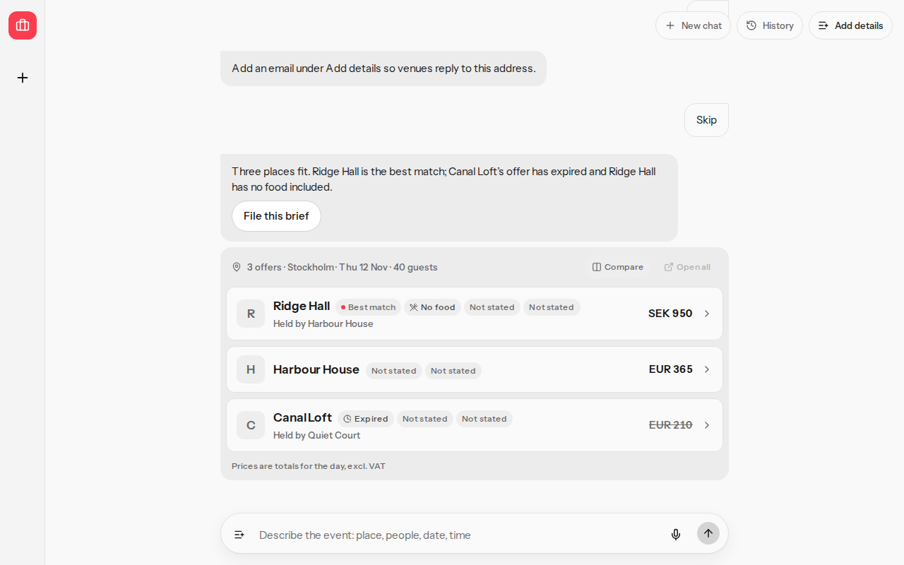
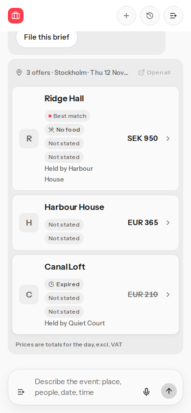

# Rank within one currency

Checked on main `eae93a5` before the change. Reference #16.

## A

still failed, fixed

An open euro offer with two gaps ranked behind an expired euro offer that had only the expired gap and a lower total. A proposal with status `expired` and a future validity date was not marked expired, so the cheaper row ranked first.

Inside one currency, open offers now rank before expired ones, then fewer gaps, then the lower total. Status `expired` or a validity date before today marks the row. An expired row in the lead currency can still sit above an open row in another currency.

## B

already passed, tests added

`notes/planner-product.md` already says to keep a row when either city is blank or the cities match. `notes/ontology.md` adds no city-filter rule. Chose that documented keep. When the brief names a city and no offer states one, every offer stays, with no "city not stated" mark.

## C

still failed, fixed

`rankComparisonRows` already kept a passed lead currency ahead of a cheaper other currency. The product path passed only a named currency. A Stockholm brief that names none therefore led with euro: Harbour House, Canal Loft, Ridge Hall. A shared minor-unit scale would order Canal Loft (21000), Harbour House (36500), Ridge Hall (95000).

The lead is now `briefCurrency`: a named currency, otherwise the event city's currency. Stockholm leads with SEK. The list is Ridge Hall (SEK 950), Harbour House (EUR 365), Canal Loft (EUR 210). Other currencies follow A to Z. Totals stay inside one currency. `Not compared` still marks a row whose currency differs when a budget amount is set.

## Checks

`pnpm typecheck` and `pnpm lint` passed. Unit tests: 247 passed. Contract tests: 7 passed. Playwright: 18 passed, including the new scenario at 390×844 and 1280×800. `pnpm crap`: `crap_max=6.00` (`briefWrittenInEnglish`). `compareWithinCurrency` is 4.00. The PR job runs `pnpm verify --skip-mutation`.

## Screenshots

Stockholm, 40 people, 12 November 2026, 09:00–17:00, dinner and a meeting room. No named currency.

