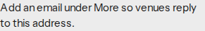
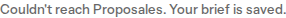
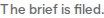

# Filing and email

## Before

Yes advanced to favorites when the brief could be searched, and only named a missing email. A missing language, date, headcount, or room count was skipped. A successful inbox filing showed on the venue detail and left the chat without that confirmation. The chat tool and the fixture turn could each call the filing client. A transport error appeared in the chat behind the open venue, and File could not be pressed again.

## After

Email stays optional while searching. When File opens Add details with no email, Email is required, the hint is `Venues reply to this address`, and an empty Apply stays on Add details. The venue detail says `Add details opened so venues reply to this address.`

Yes names the first missing fileable field in one sentence and says where to add it. Skip still ranks. A missing language is asked for. A successful filing is confirmed in the chat with `The brief is filed.`

The chat tool, the fixture turn, and the page share one filing call. A stored filing is returned without another call. A transport error is shown on the open detail, and File can be pressed again.

## Commands

From the repository root:

- `pnpm exec vitest run tests/filing-guard.test.ts tests/filing.test.ts tests/filing-paths.test.ts tests/fitness.test.ts tests/offer-detail.test.tsx tests/scripted-agent.test.ts`
- `pnpm exec playwright test e2e/filing-email.spec.ts e2e/critical-path.spec.ts`
- `pnpm crap`
- `pnpm mutation`

CRAP max is 6.00 (`briefWrittenInEnglish`). Touched functions are at or below that: `attemptFiling` 4.00, `noticeForFileableGap` 3.00, `isFileableGap` 2.00, `emailApplyDecision` 3.00, `fileBriefPressable` 4.00, `detailStatusLine` 3.00.

Mutation, threshold 0.95:

- `src/domain/fitness.ts` 0.98 (60/61)
- `src/flow/filing-guard.ts` 1.00 (71/71)
- `src/views/file-brief-state.ts` 1.00 (75/75)

The fitness survivor replaces the empty fallback in `isFileableGap` with another token that is not a fileable field. An unset field still does not match.

## Screenshots

The shots are the hint, the one question, the transport error, and the filed status. They do not include an address.

