# Run-through, 8 Oct

Shots from the fixture client at 390×844 and 1280×800. Nothing was filed to a live Proposales draft.

## History

One chat filed twice used to leave two rows, both named Untitled brief, with a raw timestamp.

After the change the same chat is one row. The name comes from the brief (Lunch in Stockholm). The line reads `3 venues · Filed twice · Thu 8 Oct, 15:41`.

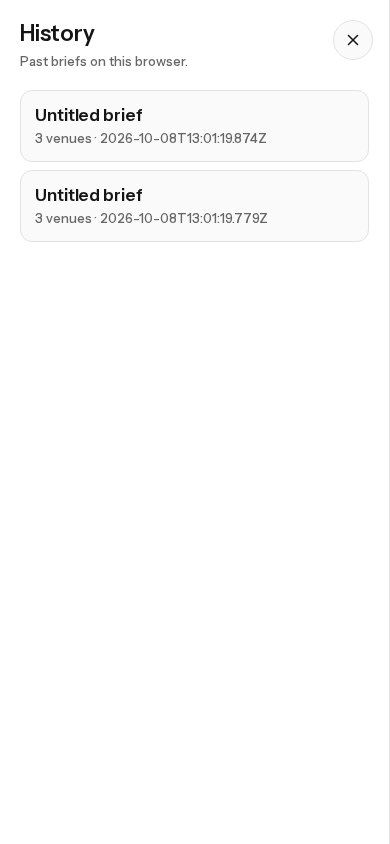

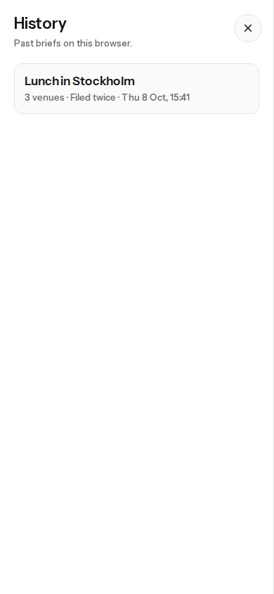

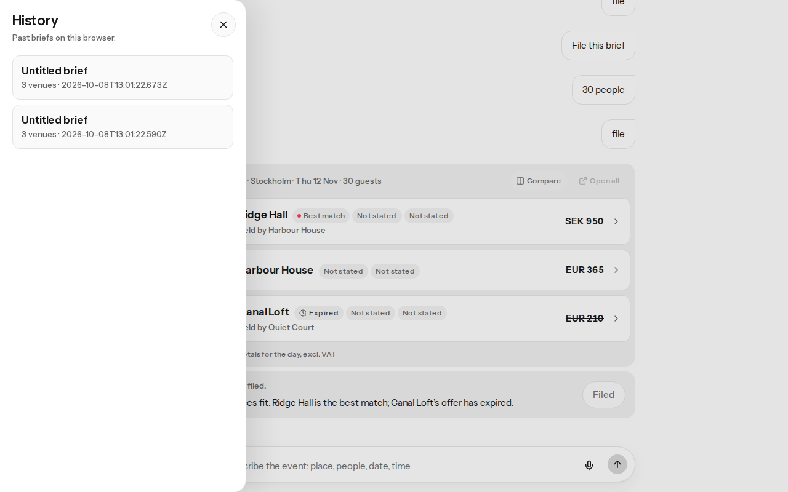

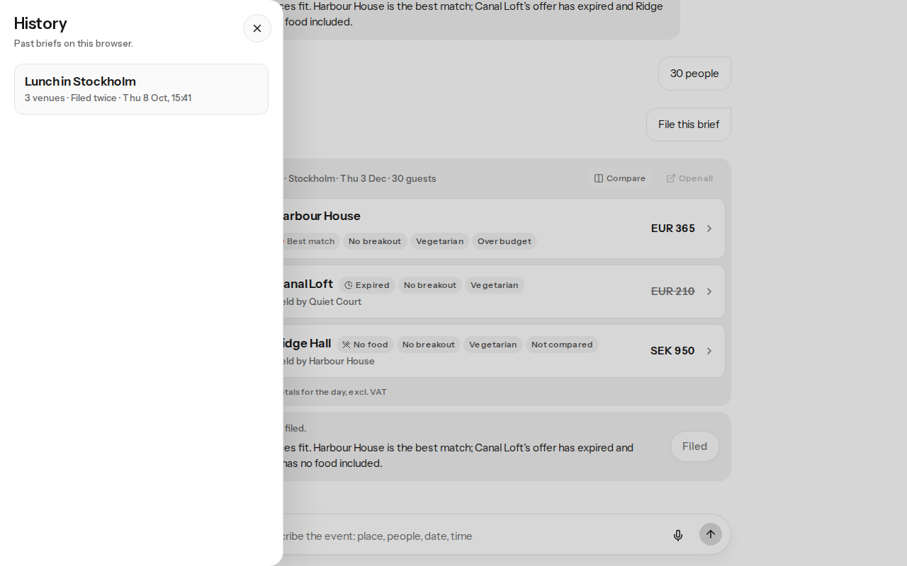

## Email

Typing file with no email used to show "Add an email under Add details so venues reply to this address." The same card now has an email field, Save, and Skip. File this brief stays enabled and still opens Add details.

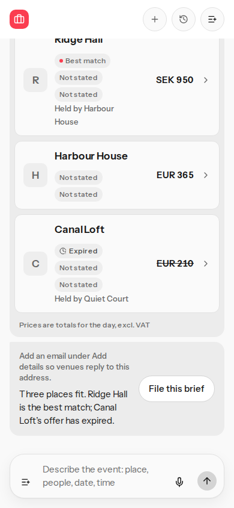

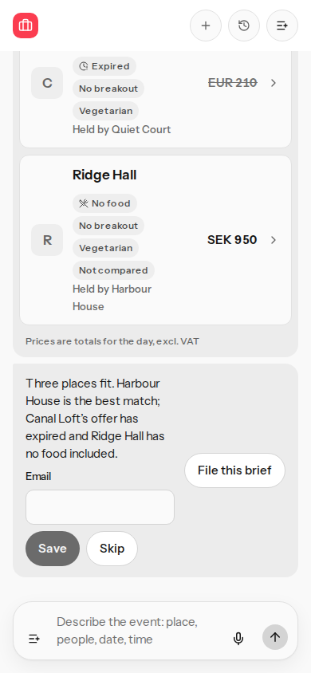

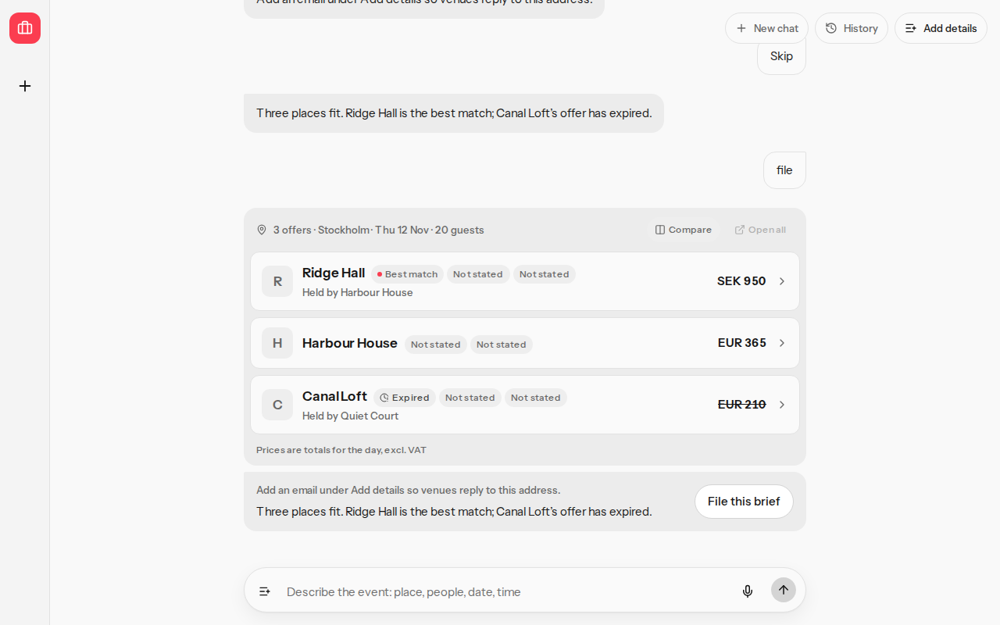

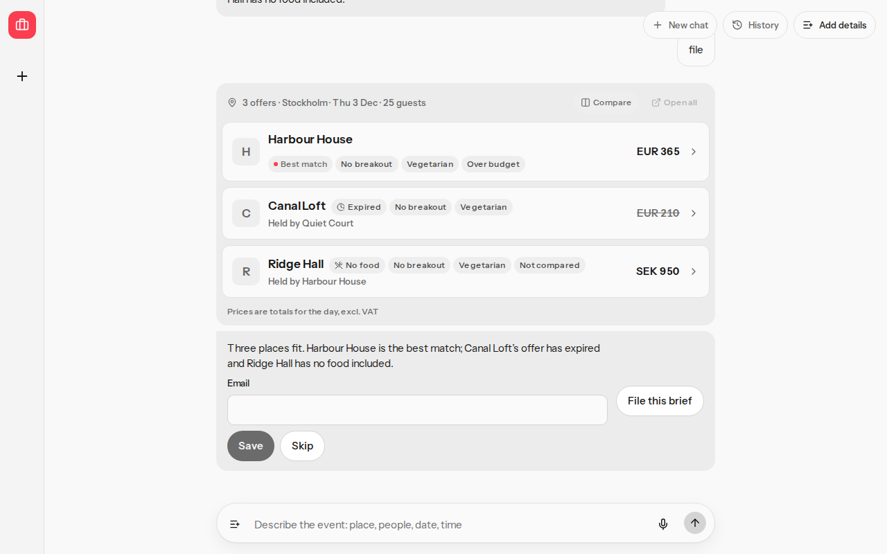

## Single-day detail

A brief for 12 Nov, 06:00-12:00, does not need an end date. On the live model path the footer used to ask for YYYY-MM-DD next to an enabled File button. The fixture already stored that end date, so the before shot shows the filed footer. After the change the same single-day detail has no end-date hint, File this brief is enabled, and Skip leaves the calm note "Left unfiled."

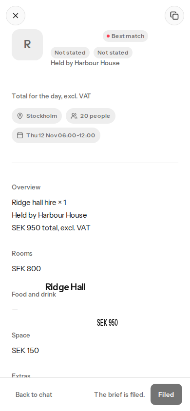

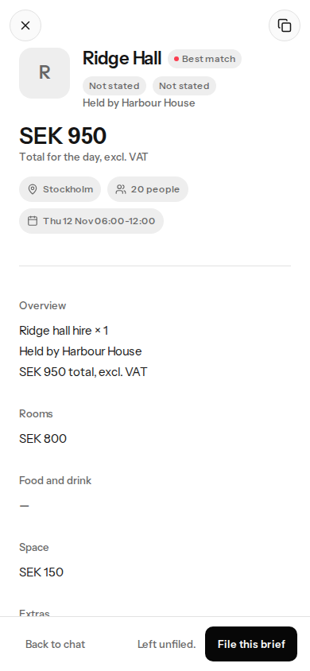

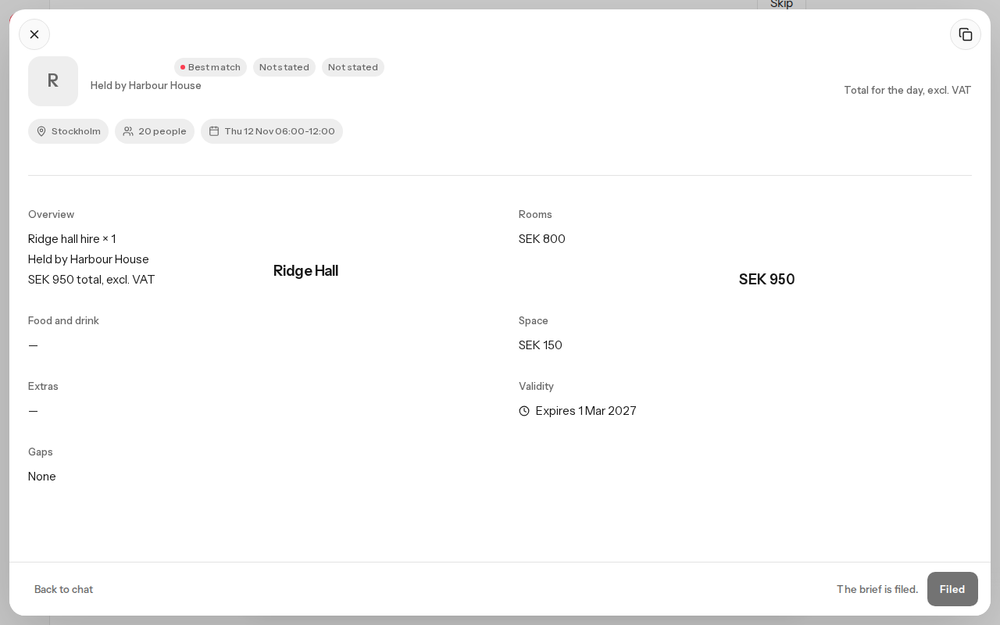

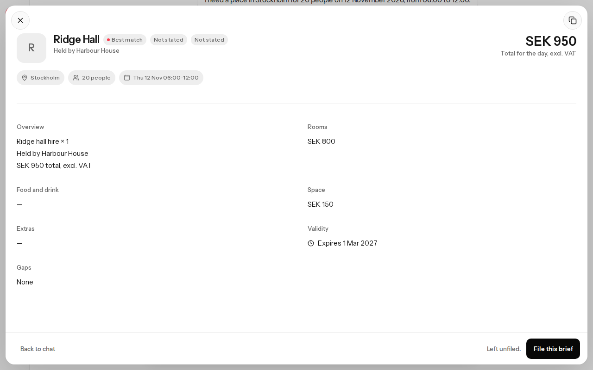
