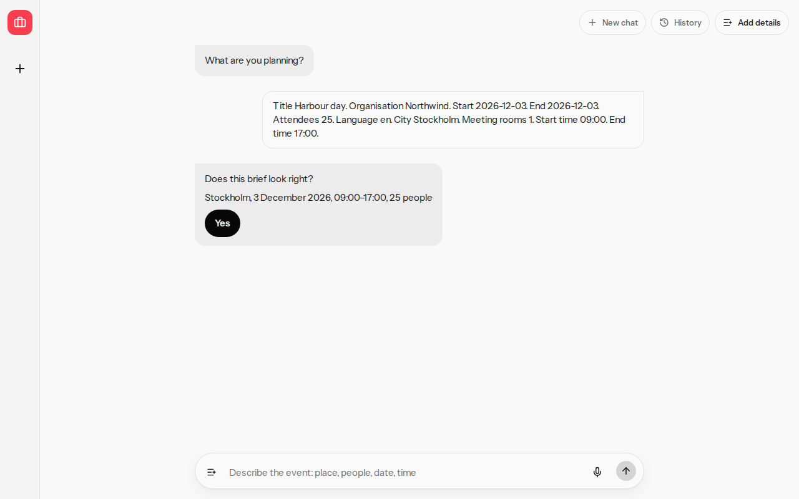
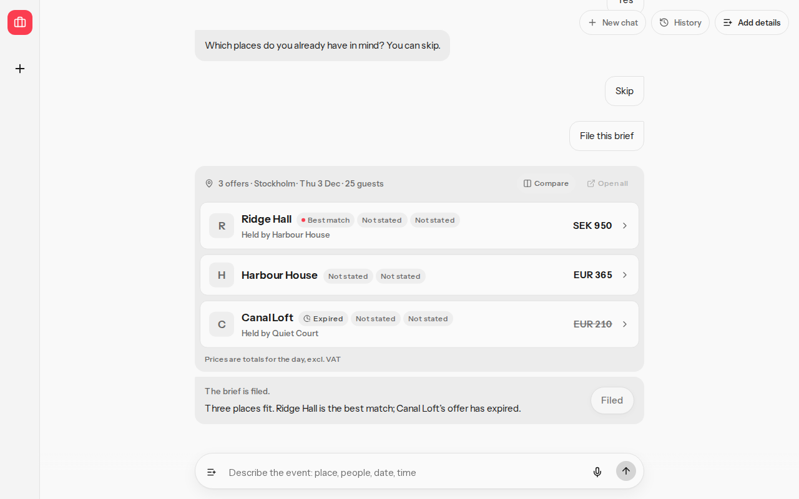
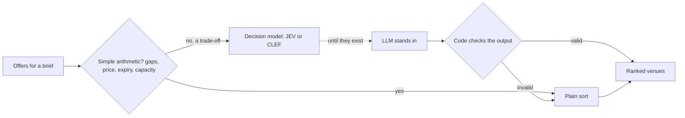
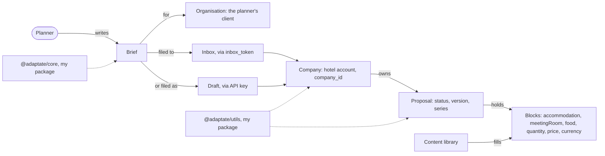
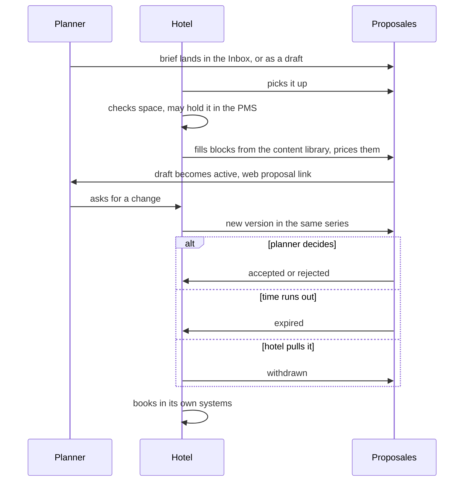
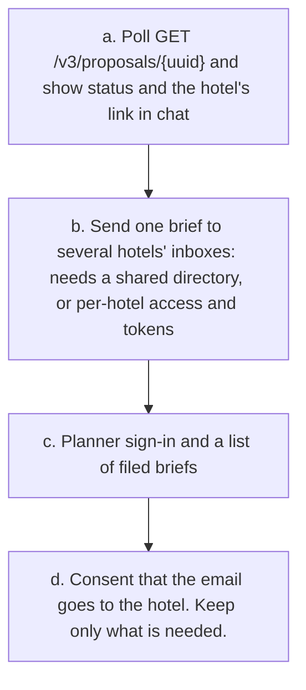
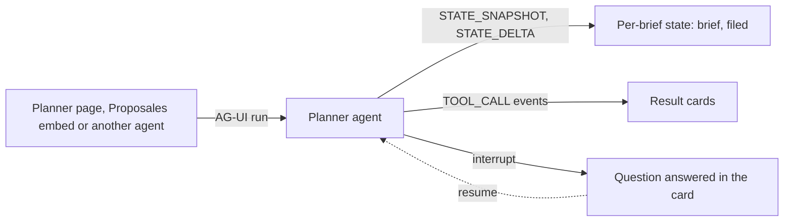

# Actualization: from case build to a real planner

What it takes for the planner to be real. What is built is in [control-card-productize.md](control-card-productize.md). Terms are in [ontology.md](ontology.md).

## 1. Who it serves

Proposales customers are hotels selling group and event business. The planner asks in one line instead of a form. The hotel gets a structured request instead of an email thread. Top: production, made-up brief. Bottom: fixture mode. File was pressed only there. Here the model only extracts the brief. Ranking and filing are plain code, so results repeat and nothing is filed by guesswork.

Ranking rule: simple arithmetic goes to the plain sort, trade-offs to a decision model. Until decision models such as JEV or CLEF exist, an LLM stands in, and code checks its output and falls back to the plain sort. Today every case uses the plain sort.

## 2. Data map

`@adaptate/core` finds gaps on a fileable brief, a comparable brief, and an offer row. `@adaptate/utils` builds Zod from OpenAPI for Company, Proposal, CreateRfpRequest, CreateProposalRequest, ProposalMutationResponse, CreateRfpResponse, and ProposalSearchResult, and the contract test checks those schemas against the HTTP readers.

[@adaptate/core](https://www.npmjs.com/package/@adaptate/core) and [@adaptate/utils](https://www.npmjs.com/package/@adaptate/utils). Source: [adaptate](https://github.com/p10ns11y/adaptate).

`inbox_token` is public by design, for website forms. The API key stays on the server.

## 3. What the API offers

| Group | Endpoints |
|---|---|
| Companies and templates | `GET /v3/companies`, `GET /v3/companies/{companyId}/templates` |
| Content library | `GET` `POST` `PUT` `DELETE /v3/content`, `GET /v1/attachments` |
| Proposals | `POST /v3/proposals`, `GET` `POST` `PATCH /v3/proposals/{uuid}`, `PATCH /v3/proposals/{uuid}/data`, `GET /v3/proposal-search` |
| Inbox | `POST /v1/inbox/{token}`, no key |

Fourteen endpoints, seller-side, scoped to the key's companies. No shared hotel directory, partner list or marketplace. No webhooks in the committed spec.

## 4. After filing

The spec's statuses also include replaced and template.

## 5. Gaps to close, in order

No webhook, so (a) polls. The web link is `url` in proposal-search results. An inbox filing returns only an id. Today history lives in one browser.

## 6. AG-UI, the direction

Direction, not shipped: AG-UI is not connected today. Each brief keeps its own state through snapshot and delta events, so filed status stays on the brief, not the chat. The server's question pauses the run and is answered inside the card. Result cards come from standard tool-call events, and the same stream lets Proposales embed the planner or connect other agents.

## References

- [AG-UI](https://github.com/ag-ui-protocol/ag-ui), protocol 1.0

Back: [Front page](../README.md)

Read next: [Product](planner-product.md)
