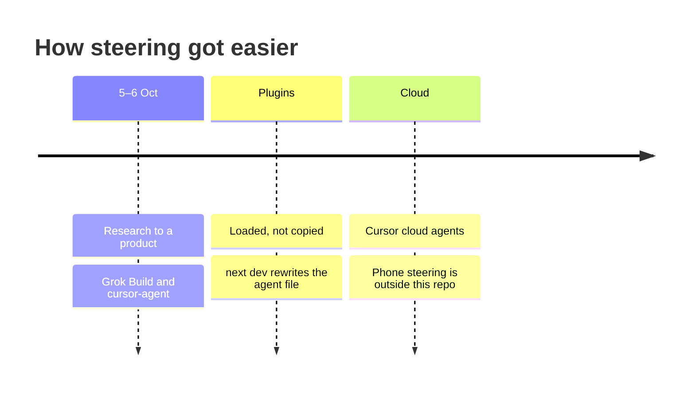

# Steering

Session span: [table](worklog.md#session-span).

## 5–6 Oct

Research to a product, with Grok Build and cursor-agent as collaborators.

| In this repo | |
| --- | --- |
| Work log | 5 Oct is report, ontology, review. 6 Oct names Grok 4.7, then Grok and Cursor. |
| Commits | None on 5 Oct. Six commits on 6 Oct carry a Cursor trailer. |
| Label | estimate |

laptop-1 sessions with Grok Build and cursor-agent show only through commits, so 5–6 Oct may be higher.

## Plugins

[p10ns11y/plugins](https://github.com/p10ns11y/plugins) removed the need to set up agent files for this project, because the harness workflow took care of it.

One plugin repo, synced to every harness I use:

| Harness | How it loads |
| --- | --- |
| Grok Build | `.grok-plugin` |
| cursor-agent, local Cursor, cloud Cursor | `.cursor-plugin` |
| Claude Code | marketplace in `.claude-plugin/marketplace.json` |

| In this repo | |
| --- | --- |
| Loaded, not copied | [Workflow](workflow.md) says plugins are loaded, not copied. |
| Checkout | Verify pins layout-content-view from [p10ns11y/plugins](https://github.com/p10ns11y/plugins) at `31d93a0`. |
| Agent file | The file says `next dev` writes it again. No commit here removes a hand-written agent file. |

## Superdesign

[Superdesign](https://superdesign.dev) is the design agent behind the UI. It reads the codebase, drafts UI directions on an infinite canvas, and hands the chosen design back to the coding agent to implement.

## Steering

Calls I made in the chats, 7–8 Oct:

- Write the docs as me. "My published npm packages", not "the owner's".
- Keep the docs short. A diagram or a picture carries the page.
- Result cards live in the chat and open to a full-screen detail. Add details is a drawer on the right.
- File a brief only when I press File.
- Show a price in its own currency. Do not convert it.
- Skip the test run when a change is only markdown.

## Cloud

Grok Bot plus Cursor cloud agents, until steering from a phone was easy.

| In this repo | |
| --- | --- |
| Branches | 31 of 35 merged pull requests use a branch name with `cursor`. |
| Trailers | Ten commits on 7 Oct carry a Cursor Agent trailer. The work log names a cloud agent that day. |
| Card | The productize card names cursor-agent in ask mode (`eea1d9b`). |
| Grok Bot | The [reference pack](design-refs/REFERENCE-PACK.md) uses it as the look of the chat column. It does not record steering. |
| Phone | evidence: outside this repo |
| 7–8 Oct | Session span, mostly agent build time with short human input. A few short sessions of input. Agents built the rest. |

`@adaptate/core` and `@adaptate/utils` are in use. Credits are on the [front page](../README.md#references).

Back: [Work log](worklog.md)

Read next: end
