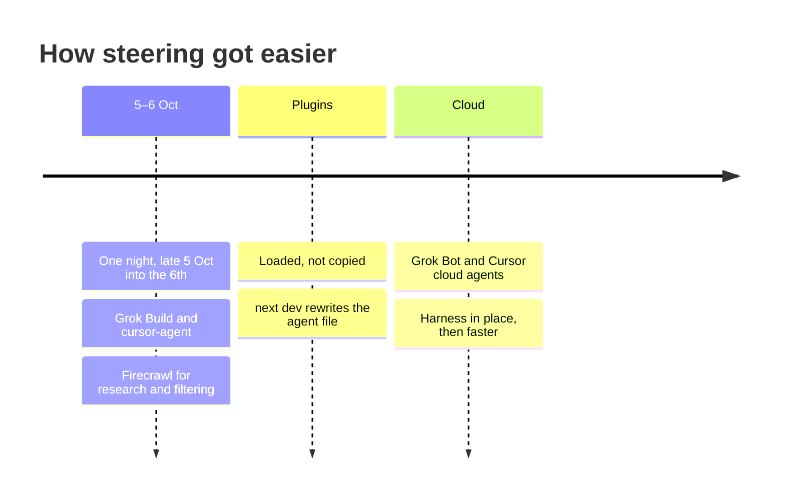

# Steering

Session span: [table](worklog.md#session-span).

## 5–6 Oct

The first days were local agents. Late on 5 Oct, around 10 at night, I ran one continuous night with Grok Build and cursor-agent into midnight on the 6th; Firecrawl was the tool I used for the research and filtering during that stretch, and I went from research to a product.

| In this repo | |
| --- | --- |
| Work log | Late 5 Oct: report, ontology, review. After midnight on 6 Oct: Grok 4.7, then Grok and Cursor. |
| Commits | None on 5 Oct. Six commits on 6 Oct carry a Cursor trailer. |
| Label | estimate |

laptop-1 sessions with Grok Build and cursor-agent show only through commits, so 5–6 Oct may be higher.

## Plugins

[p10ns11y/plugins](https://github.com/p10ns11y/plugins) removed the need to set up agent files here because the harness workflow took care of it.

One plugin repo, synced to every harness I use:

| Harness | How it loads |
| --- | --- |
| Grok Build | `.grok-plugin` |
| cursor-agent, local Cursor, cloud Cursor | `.cursor-plugin` |
| Claude Code | marketplace in `.claude-plugin/marketplace.json` |

| In this repo | |
| --- | --- |
| Loaded, not copied | [Workflow](workflow.md) says plugins are loaded, not copied. |
| Checkout | Verify pins layout-content-view from [p10ns11y/plugins](https://github.com/p10ns11y/plugins) at `31d93a0`. |
| Agent file | `next dev` writes the agent file again. No commit here removes a hand-written agent file. |
| Design | [Superdesign](https://superdesign.dev) is the design agent behind the UI. |
| Build | Cursor cloud agents do the build. |

## Cloud

Everything around it went slowly at the start. Once the harness and plugins were in place, things got easier and faster. After I started steering from Grok Bot, the product moved quickly. Grok Bot plus Cursor cloud agents carried it.

| In this repo | |
| --- | --- |
| Branches | 34 of 41 merged pull requests use a branch name with `cursor`. |
| Trailers | Ten commits on 7 Oct carry a Cursor Agent trailer. The work log names a cloud agent that day. |
| Card | The productize card names cursor-agent in ask mode (`eea1d9b`). |
| 7–8 Oct | Session span, mostly agent build time with short human input. A few short sessions of input. Agents built the rest. |
| Currency | A price stays in its own currency. It is not converted. |
| Filing | A brief is filed only when I press File. |

`@adaptate/core` and `@adaptate/utils` are in use. Credits are on the [front page](../README.md#references).

Back: [Work log](worklog.md)

Read next: end
