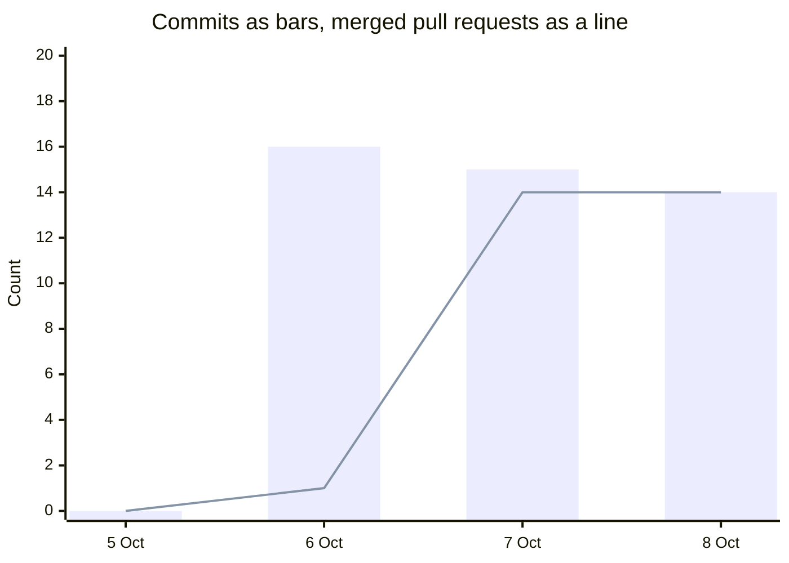

# Work log

Session span beside commits and merged pull requests. The span figures are a supplied estimate. The counts are from git and GitHub. Commands: [evidence](../docs/evidence/reading-path.md).

## Session span

Method: the owner's message, call, mail, and commit timestamps; a gap over 25 min starts a new session; each session counts its span plus 5 min.

| Day | Session span (estimate) | Low–high | Label | Commits | PRs merged |
| --- | --- | --- | --- | --- | --- |
| Mon 5 Oct | 1.6 h | 1.1–2.0 | estimate | 0 | 0 |
| Tue 6 Oct | 4.0 h | 2.4–5.0 | estimate | 16 | 1 |
| Wed 7 Oct | 6.9 h | 5.1–8.0 | session span, mostly agent build time with short human input | 15 | 14 |
| Thu 8 Oct, to 14:57 | 3.8 h | 2.5–4.6 | session span, mostly agent build time with short human input | 14 | 14 |

All four days, session span (estimate): about 16 h (11–19.5). About 9 h in five focus blocks and about 7 h in short bursts.

Mon 5 Oct and Tue 6 Oct keep the plain estimate label. On Wed 7 Oct and Thu 8 Oct the figure is session span, mostly agent build time with short human input. Input on those days was a few short sessions. Agents built the rest.

laptop-1 sessions with Grok Build and cursor-agent show only through commits, so 5–6 Oct may be higher.

Thursday's span stops at 14:57. Commits and merged pull requests are the whole Stockholm day. In this snapshot the latest stamp on 8 Oct is 13:05 Stockholm time.

## Other counts

| What | Number |
| --- | --- |
| Commits on main, 5–8 Oct | 48 |
| Pull requests merged | 32 |
| Issues closed | 27 (11 open) |
| ship-by-thursday issues | 19, all closed |
| V-findings issues | 10 (V1–V6, V8–V10, U1), all closed |
| Vitest tests | 240 |
| Playwright tests | 25 |
| Vitest plus Playwright | 265 |
| Production deploys | 30 |
| Rollbacks | 1 |

Counted from GitHub, Vercel and a test run on main at `8e61a26`, 8 Oct 17:35 UTC+2.

## Written log

UTC+2. This is the log as written with the pages. It is not the session-span estimate above.

| Date | Start–end | Time | Prompts | Harness | Notes |
| --- | --- | --- | --- | --- | --- |
| 2026-10-05 | 22:59–23:54 | 55 min | 9 | Cursor | Report, ontology, review |
| 2026-10-06 | 00:01–11:35 | 15 min | 3 | Cursor | Tau, signup, null token |
| 2026-10-06 | 14:26– | | 8 | Cursor | Log and notes |
| 2026-10-06 | 14:56–15:16 | 20 min | 1 | Grok 4.7 | S1 scaffold |
| 2026-10-06 | 15:27– | | 2 | Grok + Cursor | Handover |
| 2026-10-07 | 10:56–12:00 | 64 min | 1 | Cloud agent | Sticky composer, fixture path |

| Minutes | Prompts | Harnesses |
| --- | --- | --- |
| ~154 min | 24 | Cursor, Grok build, cloud agent |

Counts are `origin/main` at `4b99a6a`. Open pull requests are not in the totals.

Back: [Architecture](../docs/ARCHITECTURE.md)

Read next: [Steering](steering.md)
