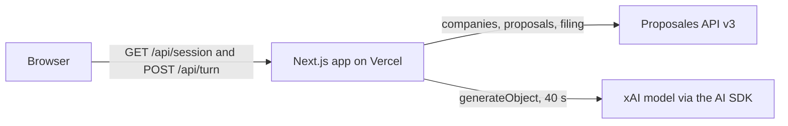
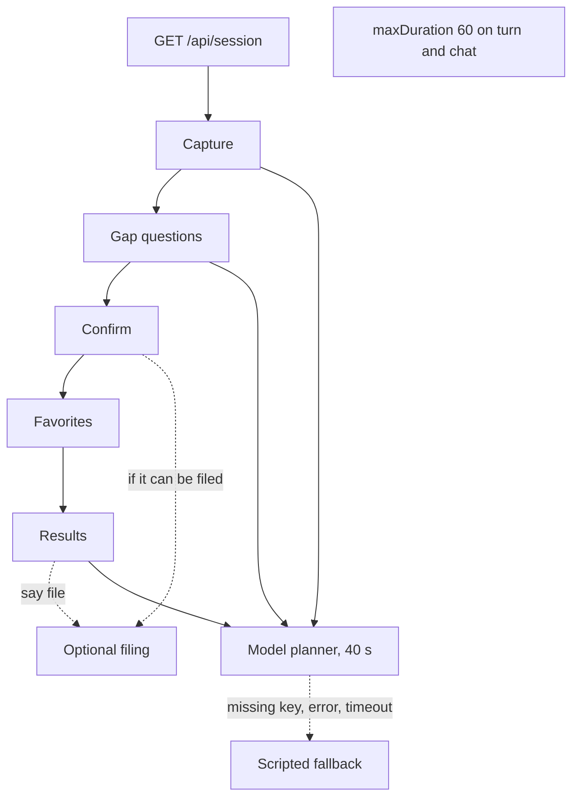
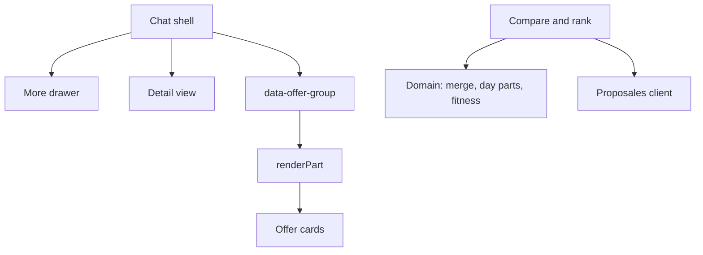
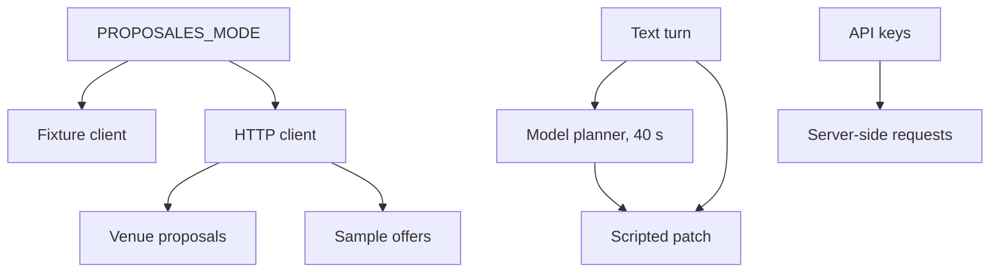
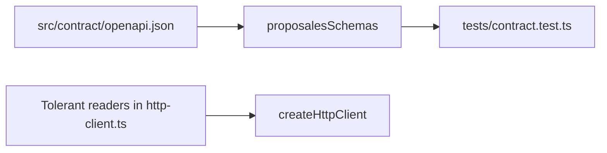

# Architecture

This document is for an engineer reviewing the planner bench against the code in `src`. Stored instants and the comparison date are UTC. Display converts those UTC calendar fields into weekday and month labels.

## System context

The same picture is the System context page of [diagrams/architecture.tldr](diagrams/architecture.tldr).

The browser runs `PlannerSession`. The page loads with `GET /api/session`, then posts each action to `POST /api/turn` with the action and the snapshot. The app is the Next.js project in `planner-bench`. On Vercel the project root is that directory. `src/app/api/session/route.ts` returns the opening snapshot. `src/app/api/turn/route.ts` runs the turn and sets `maxDuration` to 60.

Live mode calls the Proposales API from `createHttpClient`. Company list, proposal search, and proposal reads use the v3 paths. Filing posts a draft to `/v3/proposals`, or posts to `/v1/inbox/{token}` when the company has an inbox token. Brief extraction calls `generateObject` from the AI SDK through the xAI provider. The model id is `grok-4.7` unless `PLANNER_MODEL` sets another id. That call asks for low reasoning effort.

## Turn sequence

The same picture is the Turn sequence page of [diagrams/architecture.tldr](diagrams/architecture.tldr).

`GET /api/session` lists companies into an opening snapshot whose phase is `capture`. A company-list failure still returns 200, with no companies, `filingAvailable` false, and the notice `Filing is unavailable right now.` `POST /api/turn` reads the action and the snapshot. A missing snapshot loads the session again. `today` is the UTC date from `new Date().toISOString()`.

Capture stores a brief patch and moves to `confirm`. While comparable fields are missing, the phase stays `confirm` and the reply asks `questionForGap` for the first gap. A budget with no per person, pp, each, or total qualifier then holds `confirm` and asks `Is that per person or total?` until the answer sets the basis. Yes and the confirm button stay on that question. The answer sets `budget.scope`: per person, pp, and each are per-person, and total is total. That basis is what later marks an offer Over budget. The scripted reader also treats per head, per attendee, per guest, a head, in total, and overall as a basis. An explicit qualifier skips the question. The model planner and the scripted extractor both follow these rules. With no gaps, the question is `Does this brief look right?` Confirm, from the button or from a yes, moves to `favorites` and asks which places are already in mind. Skip leaves that list empty. A name that matches Harbour House, Ridge Hall, or Canal Loft is marked on the row. Favorites then rank. Results keep a phase of `results`.

Filing is optional. Confirm files when the brief is fileable, filing is still empty, and a company id is available. When the email is missing, confirm still moves on and sets the notice `What email should receive the venue replies?` A brief written in English with no stated language is stored as `en`, on the model path and the scripted path. Any other brief keeps its language unset until one is stated. The word `file` files from the current phase. When a filing is already stored, `file` returns that filing and does not call Proposales again. While a fileable field is missing, `file` asks for the first one and does not call Proposales. The offer detail shows the latest filing message. Its File button opens More with the email field focused when the email is missing. After a filing, including the filing confirm makes, the button reads Filed and is disabled. Saving More while that detail is open leaves the same offer open. A fileable brief has an email, start date, end date, attendee count, language, and a room count when the stay runs past the start date. `projectBriefFlow` projects the brief, the filing result, and the offers onto a stage: `collecting`, `fileable`, `filed`, or `comparing`.

A text turn resolves a brief patch through the model planner when `XAI_API_KEY` is set. The call uses `AbortSignal.timeout` of 40 seconds. Capture, a gap answer, and a revision during results are the turns that ask. Confirm, favorites, show more, and opening a row leave the planner field as `scripted`. A missing key returns the scripted patch from `extractBriefPatch` before any model request. A throw, including that timeout, or an object that fails `plannerBriefSchema`, returns the scripted patch as well. The turn still responds 200, and `planner` is `model` or `scripted`. The prompt tells the model to leave unknown fields out. The model extraction schema omits `budgetMinor` and stores only `timeAssumption.dayPart`, with the assumed span filled in code. The merge keeps a scripted field when both sides set it, and includes a model field the script left unset. A scripted budget that repeats the same amount and currency without a basis keeps the basis the model already set.

`/api/turn` and `/api/chat` both set `maxDuration` to 60, which leaves room after the 40 second window for the scripted fallback. The page calls `/api/session` and `/api/turn`. `/api/chat` streams a reply, a snapshot, and a `data-offer-group` part. Its tools run the scripted turn, and a failure of that stream, including the same 40 second abort, falls back to a scripted reply. The shell builds the offer part locally.

A line that asks what this is explains and waits. A line outside the planner sets a short hold. The phase stays where it was.

## Components

**Domain.** `mergeBrief` lets the incoming patch replace a field it sets. A patch that touches the clock replaces `timeAssumption`. Food requests merge meal and diets, and a food request sets `foodRequired` when it was unset. Diet names are canonicalized. Budget currency is stored in uppercase. Day parts fill a clock when the words name a span and no clock was given: full day and all day are 09:00–17:00, half day and morning are 09:00–12:00, and afternoon is 13:00–17:00. Fitness checks use `makeConditionalSchemaTransformer` from `@adaptate/core`, a runtime dependency. A comparable brief needs a city, a start date, a start time, an attendee count, and an end time unless a duration is set or the end date is after the start date. A fileable brief needs an email, both dates, an attendee count, a language, and rooms when the stay continues. `normaliseProposal` sums each block's package split times its quantity into rooms, food, space, and extras. `value_without_tax` is used when present, otherwise `value_with_tax`. A title ending in ` (demo venue)` is shown without that suffix.

**Proposales client.** `PROPOSALES_MODE=live` selects `createHttpClient`. Any other value, including an unset value, selects the fixture client. The runtime readers are `companyReader`, `rfpReader`, `draftReader`, `proposalEnvelopeReader`, `searchEnvelopeReader`, and `searchIdentityReader`. They accept a null inbox token. Proposal and search `data` is `unknown`, so the fields on that object are included in the value passed on. Search reads `/v3/proposal-search?limit=25`, skips rows whose `data.planner_bench_brief` is true, and fetches the remaining drafts five at a time. Every request sends the user agent `planner-bench/` plus the version in `package.json`, currently `planner-bench/0.1.0`.

**Compare and ranking.** `offersForBrief` keeps an offer when either city is blank. When both are set, they match after trim, lowercasing, and stripping accents. The offer drops when the attendee count is below `minCapacity` or above `capacity`. A missing bound keeps the offer. Unstated breakout rooms and unstated dietary needs each render a neutral chip whose text is `Not stated`, on the offer card and in the detail view. The accessible name is `Breakout not stated` or `Diet not stated`. Those marks are excluded from the gap count. A breakout gap is recorded only when the brief states a count the offer fails. A diet gap is recorded only for a named diet the offer does not cover. `rankComparisonRows` places rows in the brief's budget currency first when that currency is set. Otherwise the lead currency comes from the row with the fewest gaps, with ties broken by currency code from A to Z and then by the lower total. Inside one currency, fewer gaps come first, then a lower total. No currency conversion happens. A per-person basis multiplies the budget by the attendee count when that count is above zero. A total basis uses the budget amount. An offer total above that ceiling is an Over budget gap when the currencies match. A budget with no basis sets no ceiling. `budgetMinor` counts only when no budget is set, and a total above it counts as a gap then. The favorite flag sits on the row and is separate from the sort. The best match is the first ranked row that is still unexpired. When every row is expired, `bestNonExpiredIndex` is -1 and no row is marked best match. An expired row can still sort first.

**Contract seam.** Results become an `OfferGroupPart`, wrapped as a part whose type is `data-offer-group`. `renderPart` accepts that part and four props: `hiddenCount`, `openName`, `onOpen`, and `onShowMore`. It parses the part and renders `OfferGroupCard` from those props. This is the seam where an AG-UI stream, or the existing `/api/chat` writer, can hand the same part to `renderPart`.

**UI.** `PlannerShell` is the chat: a thread, a sticky composer, and suggestions on an empty capture. Speech uses the browser speech API when the browser has it. Typing always works. The offer cards sit in the assistant reply. Compare appears when the visible group has two or three offers and is at least 640 pixels wide. Show more adds five rows. `OfferDetail` opens over the thread, records the offer on the `offer` query, and closes back to the same place in the chat. `MoreDrawer` edits event name, organisation, email, language, rooms, meeting rooms, food, notes, and budget. Save sends `moreEdited` for the fields that changed. History stays in `localStorage` on the browser.

## Data and error paths

Fixture mode is the default. The fixture client serves the committed venue proposals from memory, and the screen shows no source chip. Live mode uses the HTTP client. Rows from that load say `Live offers`. An empty search, a thrown load, or a proposal that fails normalisation substitutes the sample proposals and the screen says `Sample offers`. One draft that fails normalisation replaces the whole list. A draft response that fails the envelope reader is dropped, and the other drafts remain.

Unknown fields travel in two places. The extraction prompt tells the model to leave unknown fields out, and the merge includes a model field the scripted patch left unset. On the wire, proposal and search readers keep `data` as `unknown`, so those fields are included for normalisation. Normalisation copies city, capacity, `min_capacity`, `day_part`, and `event_type` when they parse. Offer day parts are `full_day`, `half_day_morning`, `half_day_afternoon`, `evening`, `overnight`, and `multi_day`. Day part and event type neither filter nor rank. The brief stores its span on `timeAssumption`, which is a separate vocabulary from the offer's `dayPart`.

A missing `XAI_API_KEY`, a model error, or the 40 second timeout resolves the brief with the scripted extractor. The turn response stays 200. A Proposales response with a failed status throws, and the error carries that status. Session open still succeeds when company lookup throws. Ranking still runs, with the filing notice set. A failed `fileBrief` keeps that notice, and the draft-created sentence stays unset. The browser shows `Couldn't reach Proposales. Your brief is saved.` when the turn status has failed, the snapshot fails to parse, or the fetch throws. A turn body that is not a JSON object, or an unknown action, is a 400. Invalid JSON or a snapshot that fails the schema throws, and the route has no handler around it. Live mode with an empty API key throws from `createClient`. The turn route has no handler around that throw.

The browser posts the action and the snapshot. `XAI_API_KEY` and `PROPOSALES_API_KEY` are read on the server. The bearer token is set on the server-side Proposales request, and the model key is passed to the xAI provider. The inbox post goes out without the bearer token. The turn JSON contains the snapshot and `planner`. Company records in that snapshot include the inbox token.

Dates and times are computed in UTC. `today` and history timestamps come from `toISOString`. `expires_at` seconds become a UTC instant, and a row is expired when that instant's UTC date is before `today`. Display converts the UTC calendar date into a weekday and a month label, using `Date.UTC` so the weekday matches the stored date. Brief clocks stay `HH:MM` strings. Filing joins a date and a clock into a `Z` timestamp, using `00:00` when no clock is set.

## Contract testing

The committed spec is `src/contract/openapi.json`. `proposalesSchemas()` loads that file from the filesystem, dereferences it with `@adaptate/utils`, and builds Zod schemas for Proposal, Company, CreateRfpRequest, CreateProposalRequest, ProposalMutationResponse, CreateRfpResponse, and ProposalSearchResult. `@adaptate/utils` is a devDependency, and only the contract test imports the OpenAPI loader. The import of `proposalesSchemas` lives in `tests/contract.test.ts`.

The running client checks responses with the readers in `src/proposales/http-client.ts`. The contract test shows the generated company schema rejects a null timezone and a loose website URL, and the generated proposal schema rejects a loose email, a loose website, and null `is_agreement` and `pending`. The HTTP client tests parse a company and a proposal that carry those values. The readers keep the id, name, inbox token, and the unknown `data` they were asked to read.
