# Architecture

The bench takes a brief, confirms it, and ranks venues. Instants and `today` are UTC. The screen turns each stored date into a weekday and a month with `Date.UTC`. `expires_at` seconds become a UTC instant. A row expires when that date is before `today`. Brief clocks stay `HH:MM`.

## System

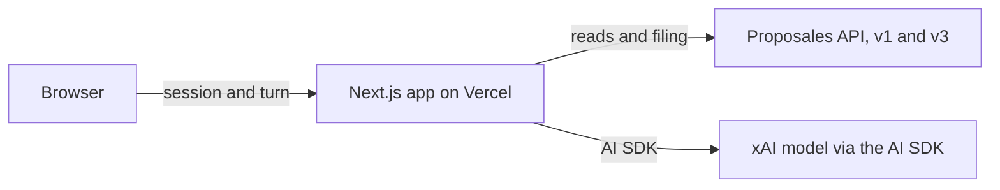

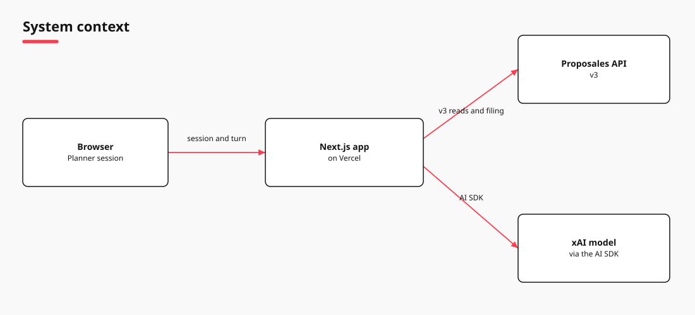

The same picture is the System context page of [diagrams/architecture.tldr](diagrams/architecture.tldr).

The browser runs `PlannerSession` from `planner-bench`. On Vercel that directory is the project root. Each post sends the action, and the snapshot when the page has one.

## Request

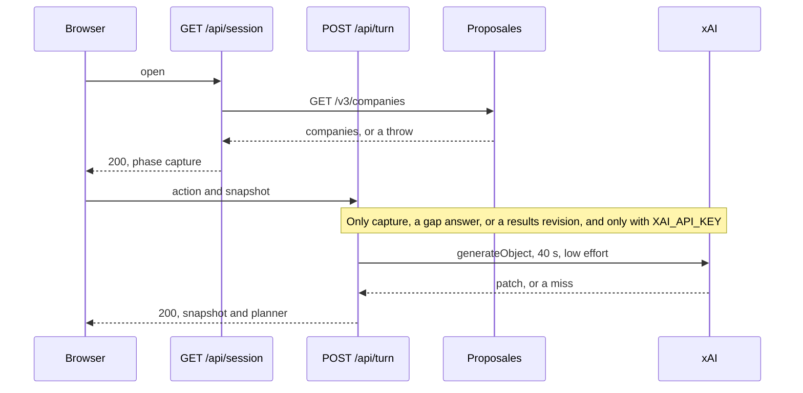

A company-list failure still returns 200: no companies, `filingAvailable` false, notice `Filing is unavailable right now.` A missing snapshot loads the session again. `today` is `new Date().toISOString().slice(0, 10)`.

Turn and chat set `maxDuration` to 60. The page calls session and turn. It does not call chat. Chat streams a reply, a snapshot, and a `data-offer-group` part. The tools `updateBrief`, `fileBrief`, `addOffer`, and `compareOffers` run the scripted turn. A stream failure, including the 40 second abort, falls back to that turn. The shell builds the same part locally.

A line that asks what this is sets `This finds a place for an event. Say the city, when it is, and how many people.` A line outside the planner sets `This bench finds a place for an event.` The phase stays.

## Screen

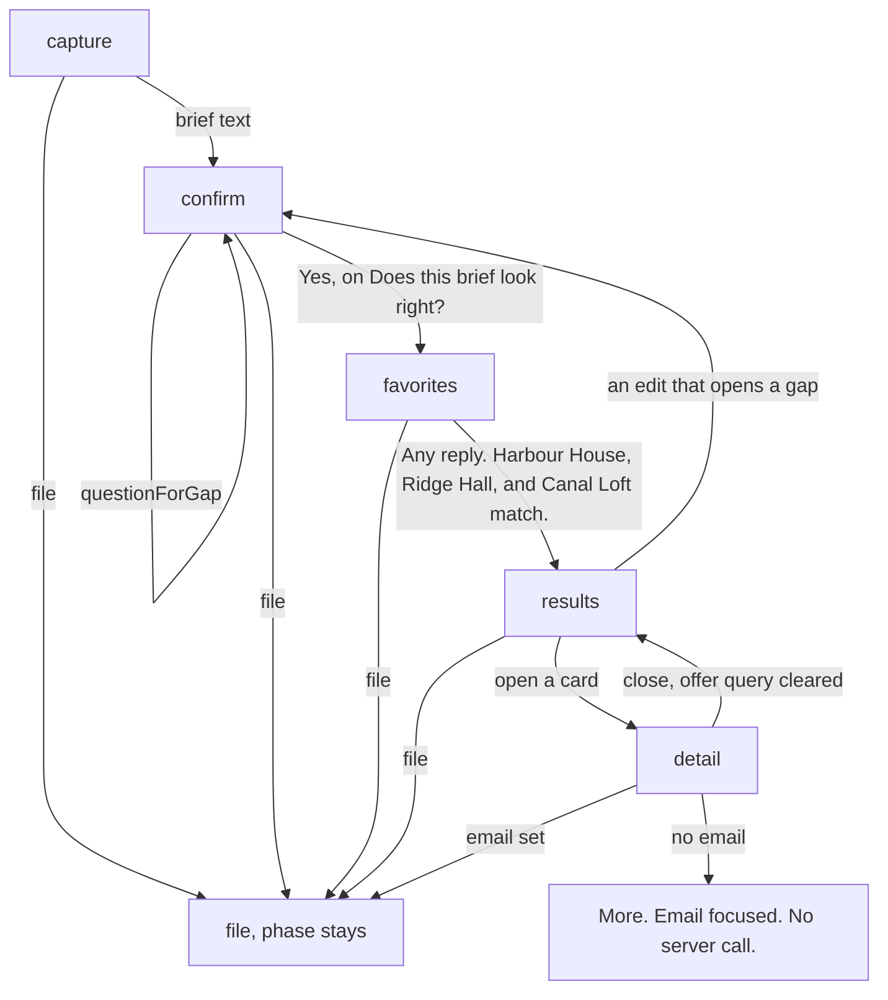

Detail sits over the thread and returns to the same place in the chat. Saving More while that detail is open leaves the same offer open. The favorite mark does not change the sort. Post rules are in [Filing](#filing).

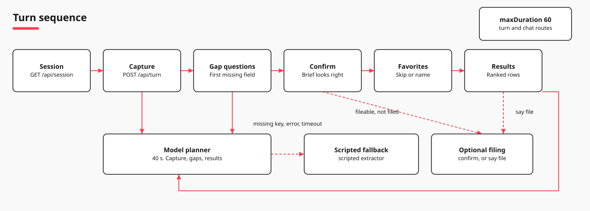

The same picture is the Turn sequence page of [diagrams/architecture.tldr](diagrams/architecture.tldr).

A comparable brief needs a city, a start date, a start time, an attendee count, and an end time. The end time can be absent when a duration is set, or when the end date is after the start date. Favorites asks `Which places do you already have in mind? You can skip.`

`MoreDrawer` edits event name, organisation, email, language, rooms, meeting rooms, food, notes, and budget. Apply sends `moreEdited` for the fields that changed. The budget field is labeled `Budget (EUR)` and writes `budgetMinor`. It does not set `budget.scope`. Speech uses the browser speech API when the browser has it. Typing always works. Compare shows for two or three visible offers when that group is at least 640 pixels wide. Show more adds five rows. History stays in `localStorage`.

## Budget

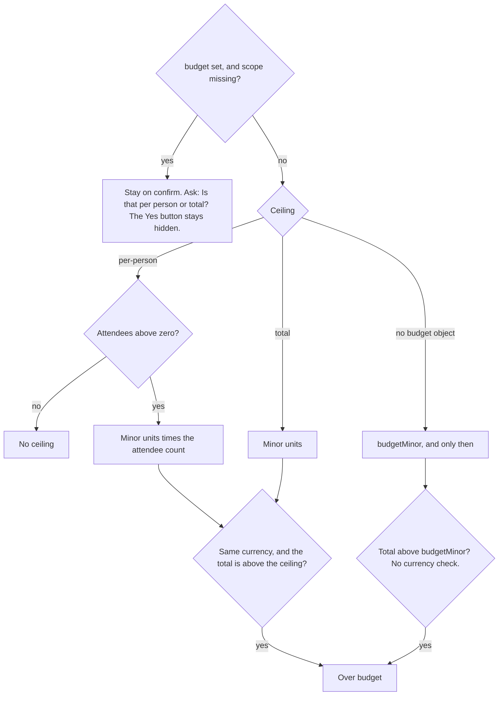

Minor units are the major amount times 100, rounded. Per person, pp, and each set `budget.scope` to `per-person`. Total sets `total`. The scripted reader also accepts per head, per attendee, per guest, and a head as per-person, and in total and overall as total. An answer calls `readBudgetScope` first, so those words set the basis on either path. A stated basis skips the question. The word yes does not.

## Extraction

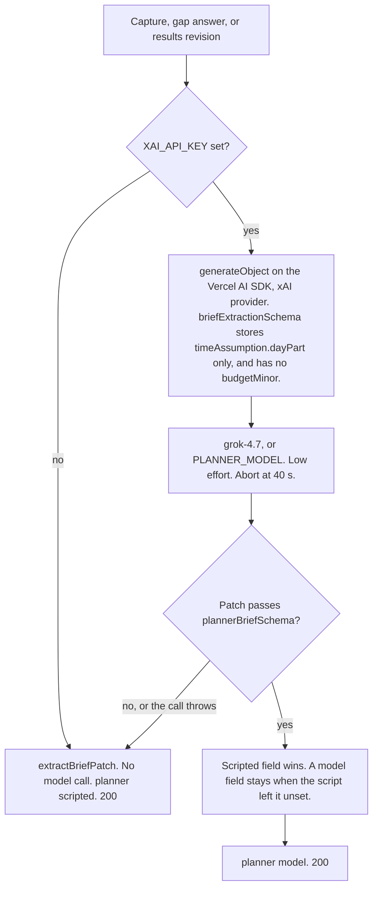

Confirm, favorites, show more, and opening a row leave `planner` as `scripted`. An English brief with no stated language is stored as `en`. The rule is in [Filing](#filing). The prompt says to leave unknown fields out. `assumedSpan` fills the clocks and the statement. Full day and all day are 09:00–17:00. Half day and morning are 09:00–12:00. Afternoon is 13:00–17:00.

A scripted budget with the same amount and currency, and no basis, keeps the basis the model set. The brief keeps its span on `timeAssumption`. Offer day parts are separate, and they do not filter or rank: `full_day`, `half_day_morning`, `half_day_afternoon`, `evening`, `overnight`, `multi_day`.

## Rank

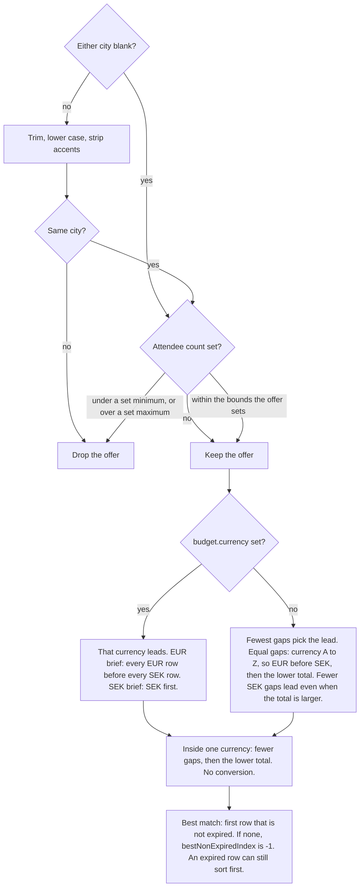

## Not stated

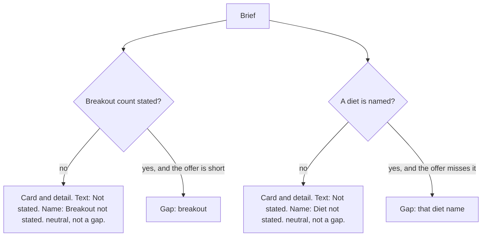

## Where the code lives

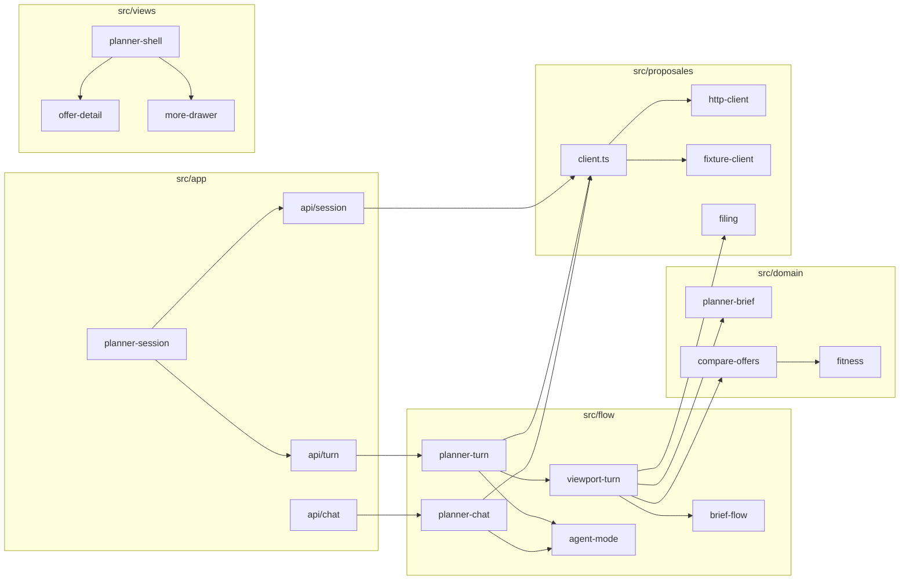

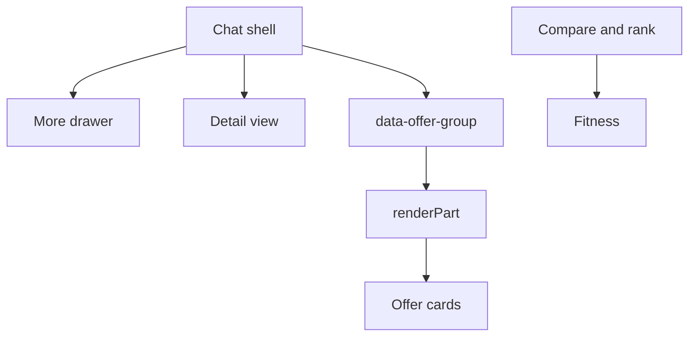

`renderPart` takes that part plus `hiddenCount`, `openName`, `onOpen`, and `onShowMore`, and draws `OfferGroupCard`.

`mergeBrief` lets a set field on the patch replace the old one. A patch that touches the clock replaces `timeAssumption`, and can clear it. Food requests merge meal and diets, and set `foodRequired` when it was unset. Diet names map to one spelling. The merge stores budget currency in upper case. Fitness uses `makeConditionalSchemaTransformer` from `@adaptate/core`.

`normaliseProposal` sums each block's package split times its quantity into rooms, food, space, and extras. It uses `value_without_tax` when that value is present, and `value_with_tax` otherwise. It drops a trailing ` (demo venue)` from the title.

## Offers and failures

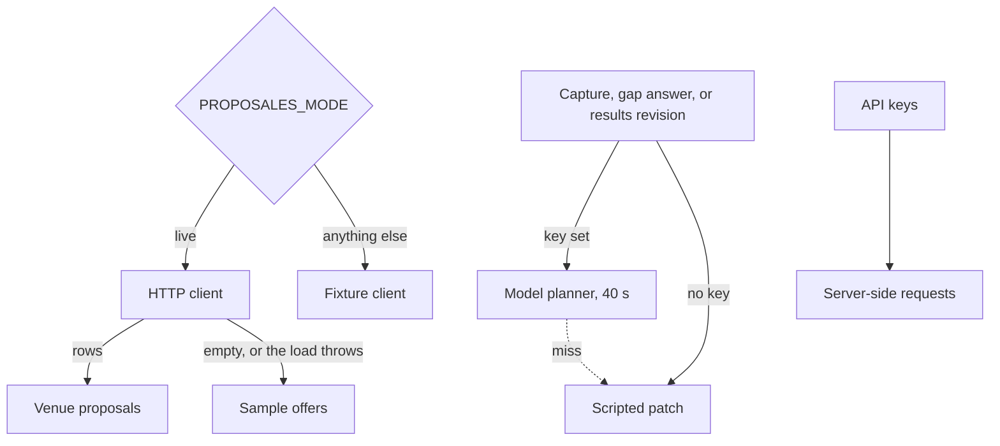

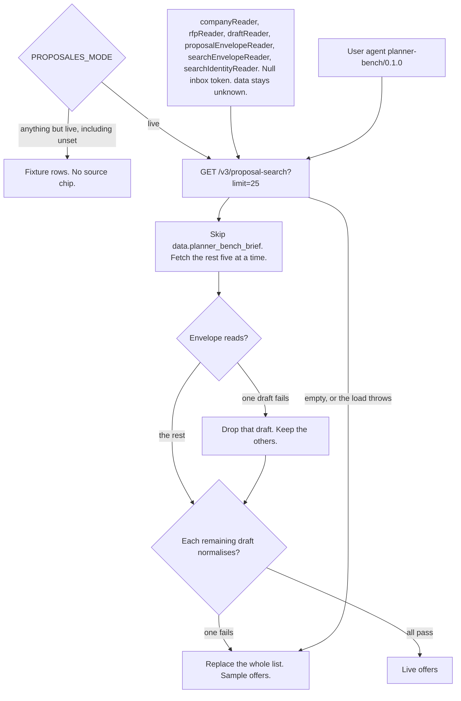

Normalisation copies city, capacity, `min_capacity`, `day_part`, and `event_type` when they parse. `XAI_API_KEY` and `PROPOSALES_API_KEY` stay on the server. Requests that send the API key also send the bearer. The model key goes to the xAI provider. The turn JSON returns the snapshot and `planner`. Each company in that snapshot is id and name.

| What happens | Status |
| --- | --- |
| Invalid JSON. `request.json()` throws on turn and on chat. Neither route catches it. | 500 |
| The snapshot fails its schema. `parse` throws. | 500 |
| Live mode and an empty key. `createClient` throws on session, turn, and chat. | 500 |
| The turn body is not a JSON object, or the action is unknown. | 400 |
| Missing key, model error, or the 40 second timeout. | 200, `planner` is `scripted` |
| Company lookup throws while the session opens. | 200. Ranking still runs. Notice: `Filing is unavailable right now.` |
| The turn status failed, the snapshot fails to parse, or the fetch throws. | The browser shows `Couldn't reach Proposales. Your brief is saved.` |

## Filing

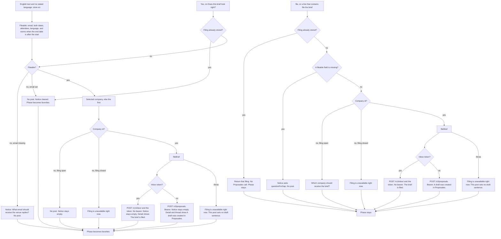

`addEnglishLanguage` in `brief-language.ts` stores `en` when the text has two words from a small English list, no accented letters, and none of the Swedish, French, or German marker words. A language already on the brief, a language in the patch, `in swedish`, `på svenska`, or `Language` plus two letters other than `en` leaves the language as it is. The model path and the scripted path both do this.

With an email, the detail button sends `file`. With no email, it opens More, focuses Email, and does not call the server. The detail shows the latest filing message. A stored draft shows `A draft was created in Proposales.` A stored inbox filing shows `The brief is filed.` A successful Yes leaves the notice empty, and the detail still shows that sentence. The draft sentence also shows in the thread. The word `file` puts the inbox sentence on the notice. After a filing, including the filing Yes makes, the button reads Filed and is disabled.

`projectBriefFlow` sets the stage to `collecting`, `fileable`, `filed`, or `comparing`. Offers join that stage only after a filing result is stored. Ranked rows can still show while the stage is `collecting` or `fileable`.

An empty event name titles the draft with the city and the date. Each filed date joins its clock as a `Z` timestamp, and uses `00:00` when the clock is missing. The inbox body sets `is_test` to `1`. Draft data sets `planner_bench_brief` to true.

`/api/chat` files inside `runFixtureTurn`. That happens only when the user text says file, and the company id is `selectedCompanyId` alone. The `fileBrief` tool sends `file the brief`, and it may set the company id from the tool first. That chat path can post again. The page path returns the stored filing.

## Contract

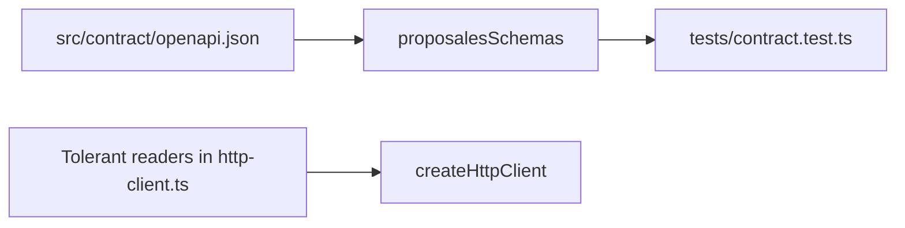

`proposalesSchemas()` reads that file, follows its refs with `@adaptate/utils`, and builds Zod schemas for Proposal, Company, CreateRfpRequest, CreateProposalRequest, ProposalMutationResponse, CreateRfpResponse, and ProposalSearchResult. `@adaptate/utils` is a devDependency. Only the contract test imports the loader.

The company schema rejects a null timezone and a loose website URL. The proposal schema rejects a loose email, a loose website, and null `is_agreement` and `pending`. The HTTP client tests parse a company and a proposal that carry those values. The readers keep the id, the name, the inbox token, and the unknown `data`.

## Checks

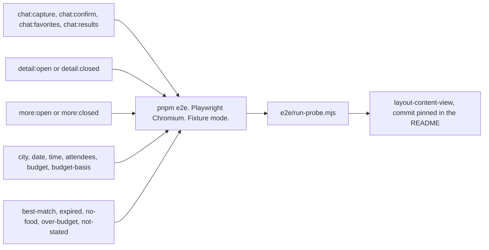

The check job runs typecheck, test, lint, and build. The e2e job runs `pnpm e2e`, then the probe.
