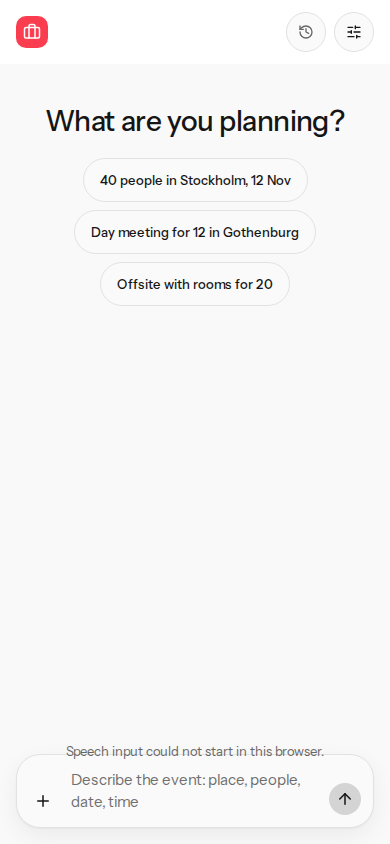
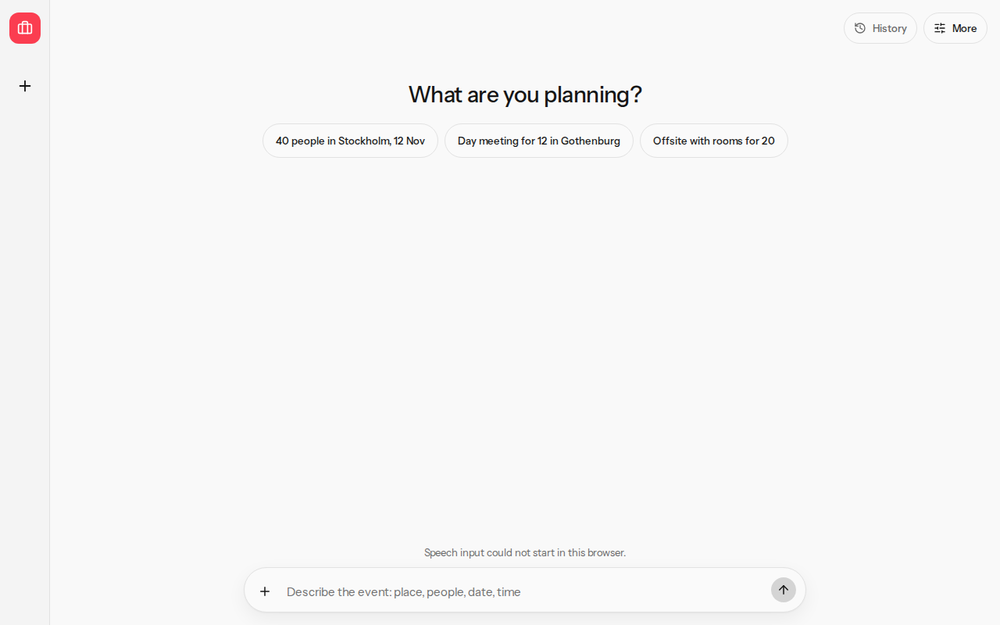

# Composer microphone

## Before

`transcriptFromSpeechEvent` treated `results` as an array. Browsers return a list-like `SpeechRecognitionResultList`, so `Array.isArray` failed and every transcript was empty. `start` had no error or end handling. Speak stayed in the composer when speech was missing, and a constructor that threw on start left a control with nothing to say.

## After

Results are read by index and length, including a list that is not an array. Listening sets `aria-pressed` and the accessible name Listening. A missing constructor hides Speak. A thrown start or a speech error hides Speak and shows why. End clears the listening state. Typing still works. The end-to-end stub does not open a microphone.

## Commands

From `planner-bench`:

- `pnpm crap` exited 0. `crap_max=6.00` with threshold 6. The worst function in `src/views/speech-input.ts` is `speechButtonState` at 5.00 with full statement coverage. The scoped worst remains `briefWrittenInEnglish` at 6.00.
- `pnpm mutation` exited 0. `src/views/speech-input.ts: mutation_score=1.00 mutants=252 killed=252`. The scoped total was `mutation_score=1.00 mutants=1145 killed=1142 threshold=0.95`.
- `pnpm verify --skip-mutation` exited 0. Unit, contract, end-to-end, the layout probe, and CRAP passed. Mutation was the separate command above.
- `pnpm exec playwright test e2e/composer-mic.spec.ts` passed at 390×844 and 1280×800. The page stub installs a speech constructor whose `start` throws.

## Screenshots

Phone and desktop after Speak. The failure message is on screen and the microphone control is gone.

