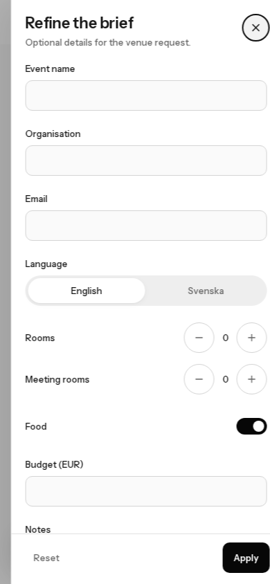
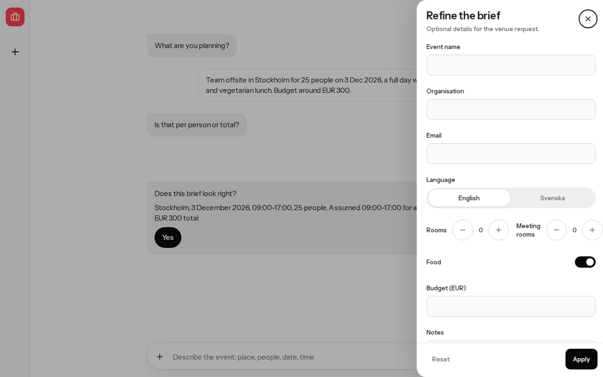
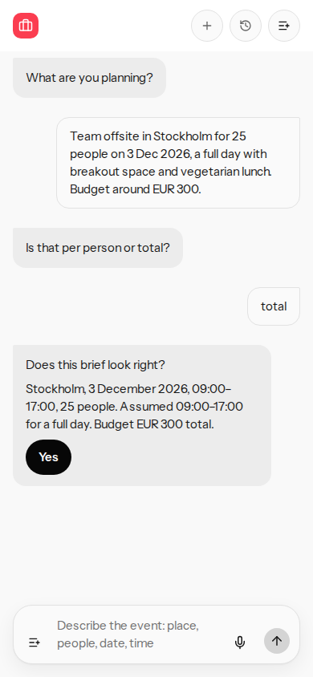
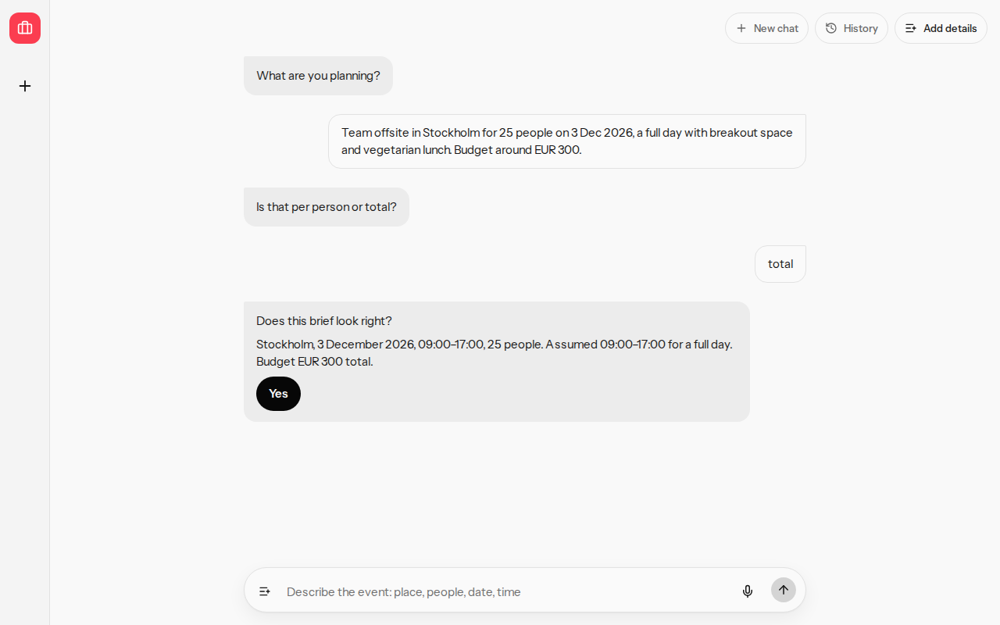
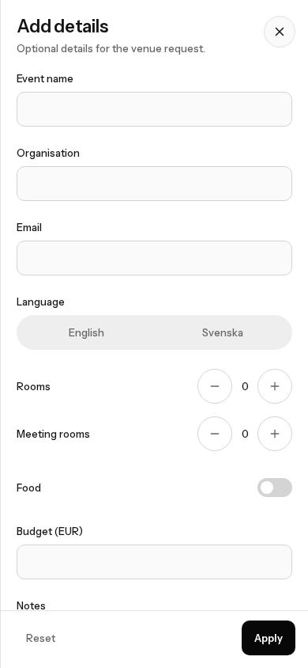

# Header, composer, and copy

Phone and desktop walkthrough of the header, the composer, and the confirm line. Sample data only. No account data.

## Before

At 390x844 the New chat control sits in `.planner-rail` (`display: none`), so it cannot be pressed. The header shows History and More. The composer control is a plus icon named Add details, with no tooltip. The drawer title is "Refine the brief".

The confirm line joins the assumed day and the budget with a space:

`Stockholm, 3 December 2026, 09:00–17:00, 25 people. Assumed 09:00–17:00 for a full day EUR 300 total`

## After

New chat is in the header beside History at 390x844 and at 1280x800, with the accessible name New chat. Pressing it mid-conversation returns to the empty home, "What are you planning?".

The header and the composer both use a list-plus icon, the accessible name Add details, and the tooltip Add details. Both icons are 16 by 16 pixels, and both controls are 40 pixels tall. The drawer title is Add details.

The confirm line is:

`Stockholm, 3 December 2026, 09:00–17:00, 25 people. Assumed 09:00–17:00 for a full day. Budget EUR 300 total.`

The budget span stays `EUR 300`. The budget-basis span stays `total`.

## Commands

From `planner-bench`:

- `pnpm exec vitest run --exclude tests/contract.test.ts` — 25 files, 176 tests, passed.
- `pnpm exec playwright test e2e/critical-path.spec.ts` — 9 tests, passed, including 390x844 and 1280x800.
- `pnpm crap` — `crap_max=6.00`, threshold 6. Worst function is `briefWrittenInEnglish`. `appendBudgetLine` is 4.00, `budgetLead` 2.00, `basisLabel` 3.00, `textRun` 1.00, `factRun` 1.00, each with full statement coverage.
- `pnpm verify --skip-mutation` — exited 0 (unit, contract, e2e, layout probe, CRAP).
- `pnpm mutation` — scores below.

## Mutation

`pnpm mutation` exited 0. Threshold 0.95. Touched module `src/view-models/facts-line.ts`: mutation_score=1.00, mutants=52, killed=52.

Suite total: mutants=945, killed=942, printed mutation_score=1.00. Other scoped files stayed at or above 0.95 (compare-offers 315/316, brief-flow 130/131, http-client 136/137, and the rest fully killed).
